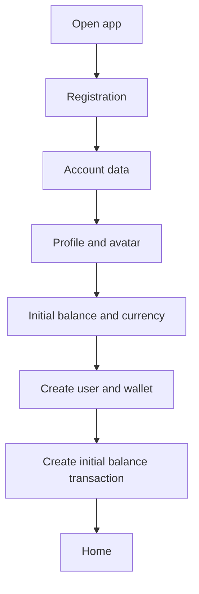
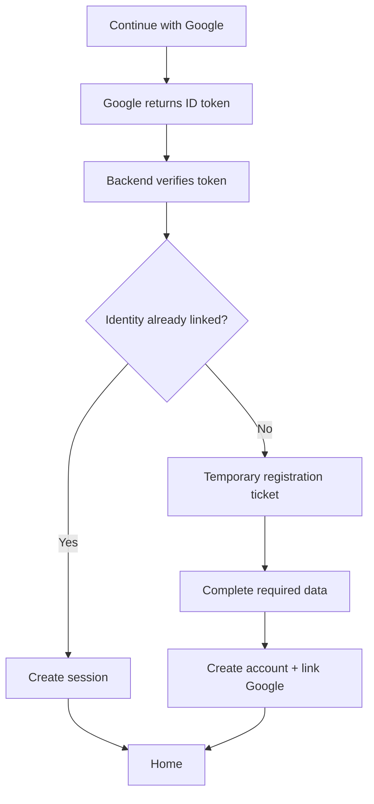
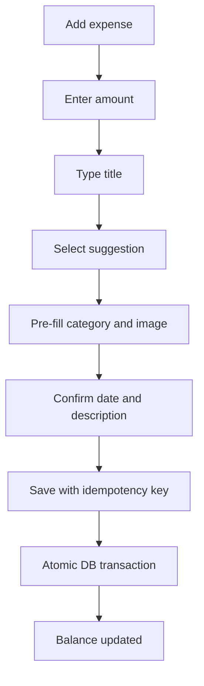
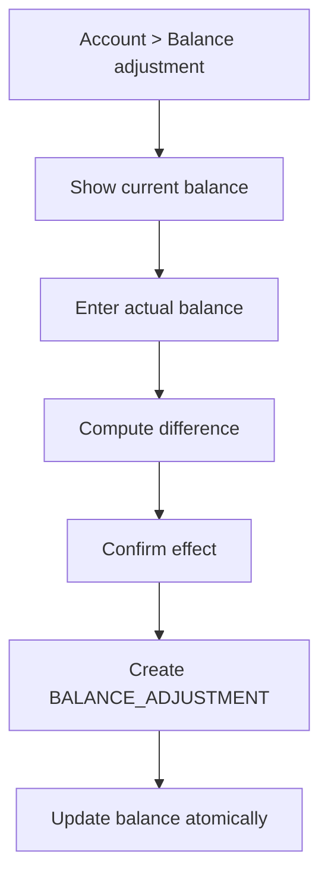

# Complete implementation plan — Personal finance management app

**Version:** 1.0  
**Date:** July 18, 2026  
**Planned stack:** Flutter · Go · PostgreSQL · Redis · Docker  
**Required host ports:** PostgreSQL `10001` · Redis `10002` · API `10003`

---

## Table of contents

1. [Product goal](#1-product-goal)
2. [Critical review of the initial draft](#2-critical-review-of-the-initial-draft)
3. [MVP scope and later features](#3-mvp-scope-and-later-features)
4. [Terminology and domain rules](#4-terminology-and-domain-rules)
5. [Information architecture and navigation](#5-information-architecture-and-navigation)
6. [Design system and UI guidelines](#6-design-system-and-ui-guidelines)
7. [Detailed screen specifications](#7-detailed-screen-specifications)
8. [Main user flows](#8-main-user-flows)
9. [Flutter architecture](#9-flutter-architecture)
10. [Go backend architecture](#10-go-backend-architecture)
11. [PostgreSQL data model](#11-postgresql-data-model)
12. [Redis's role](#12-rediss-role)
13. [Reliable balance management](#13-reliable-balance-management)
14. [REST API contract](#14-rest-api-contract)
15. [Authentication and Google linking](#15-authentication-and-google-linking)
16. [Image management, search, and crop](#16-image-management-search-and-crop)
17. [History, search, and filters](#17-history-search-and-filters)
18. [Reports, percentages, and charts](#18-reports-percentages-and-charts)
19. [Security](#19-security)
20. [Privacy and data management](#20-privacy-and-data-management)
21. [Docker and environments](#21-docker-and-environments)
22. [Observability, logging, and monitoring](#22-observability-logging-and-monitoring)
23. [Test strategy](#23-test-strategy)
24. [CI/CD and release](#24-cicd-and-release)
25. [Implementation roadmap](#25-implementation-roadmap)
26. [Acceptance criteria](#26-acceptance-criteria)
27. [Risks and mitigations](#27-risks-and-mitigations)
28. [Decisions to confirm before development](#28-decisions-to-confirm-before-development)
29. [Recommended repository structure](#29-recommended-repository-structure)
30. [Definition of Done](#30-definition-of-done)
31. [Technical references](#31-technical-references)

---

## 1. Product goal

The app must let a person manage their balance in a way that is simple yet verifiable, record income and expenses, quickly find past operations, and understand their financial trend over time.

The product must have four core qualities:

1. **Speed:** entering a common transaction must take only a few seconds.
2. **Reliability:** every change that affects the balance must be traceable.
3. **Readability:** balance, income, expenses, and trend must be understandable without accounting knowledge.
4. **Extensibility:** the MVP must be able to evolve toward multiple accounts, automatic recurrences, budgets, exports, and bank synchronization without rewriting the core.

### 1.1 Initial target users

- A person who wants to replace notes or spreadsheets with a mobile solution.
- A person who manually records expenses and income.
- A person who wants to compare months and understand which titles or categories weigh the most.
- A person who does not need, in the first version, automatic bank connection.

### 1.2 Product principles

- The displayed balance must always be traceable to recorded transactions.
- Destructive actions must be reversible or clearly confirmed.
- PostgreSQL is the authoritative source of financial data.
- Redis must not hold the only copy of any financial data.
- Amounts must never be handled with floating-point numbers.
- Dates must be stored in UTC and displayed in the user's time zone.
- The interface must distinguish income and expenses without relying solely on color.

---

## 2. Critical review of the initial draft

The draft already contains the correct core of the product. To make it implementable, however, some corrections and additions are needed.

### 2.1 Necessary changes

#### A. Manually changing the balance becomes a "balance adjustment"

A number in the profile must not be directly overwritten, because the explanation for the difference would be lost. When the user sets a different balance, the system must create a special transaction:

- technical type: `BALANCE_ADJUSTMENT`;
- amount: difference between the current balance and the desired balance;
- default title: "Balance adjustment";
- optional but recommended description;
- excluded by default from ordinary income/expense charts;
- always visible in history, with a dedicated indicator.

Example: recorded balance €500, actual balance €470. The app creates a `-€30` adjustment.

#### B. Adding the concept of category

The title alone is not enough for consistent reports. "Bar Centrale," "Caffè Roma," and "Colazione" might represent the same economic category but have different titles.

A category is therefore added, with a default value of "Other." In reports, the user will be able to group:

- by **title/template** — original requirement;
- by **category** — a more useful view for analysis;
- in the future, by merchant, tag, or account.

#### C. Adding email to manual registration

Email is needed for:

- password recovery;
- security alerts;
- identity verification;
- possible linking to Google;
- account export or deletion.

Updated registration fields:

- first name;
- last name;
- username;
- email;
- password;
- confirm password;
- profile picture or generated avatar;
- initial balance;
- currency;
- acceptance of the documents required by the product.

#### D. Separating "reusing a title" from "automatic recurrence"

The described requirement is mainly about autocompleting already-used transactions. In the MVP, **reusable templates** will be created: selecting a previous title pre-fills category, image, and usual data.

Automatic monthly or weekly transaction creation is kept as a later phase, because it requires notifications, error handling, time zones, and confirmation of scheduled operations.

#### E. Adding storage for images

PostgreSQL and Redis are not suited to directly hold all image files. The plan calls for:

- PostgreSQL for metadata and references;
- S3-compatible storage, preferably MinIO in a self-hosted environment, or a cloud bucket in production;
- the backend as the sole authorized point for upload, validation, and initial distribution.

MinIO can stay on the internal Docker network without a public host port. Alternatively, for a very small MVP, a persistent volume managed by the backend can be used, keeping the same abstract interface.

#### F. Adding edit and delete operations

A useful history must allow correcting mistakes. For every transaction the following are planned:

- detail view;
- edit;
- logical deletion;
- atomic balance update;
- audit of the action.

#### G. Adding currency and time zone

Even with a single initial currency, every wallet must have an ISO code, e.g. `EUR`. The profile also stores locale and time zone, e.g. `it-IT` and `Europe/Rome`.

#### H. Adding export and account deletion

These are important features for an app that stores personal financial data:

- CSV/JSON export;
- account deletion request;
- deletion or anonymization according to the defined policy;
- session revocation and external-provider unlinking.

### 2.2 Features not needed in the MVP

These are deferred to avoid increasing the risk of the first release:

- automatic bank synchronization;
- shared management among multiple users;
- multiple wallets or accounts per user;
- currency conversion;
- advanced budgets;
- AI-based forecasts;
- automatic receipt recognition;
- automatic recurrences;
- bulk import from statements.

The architecture must nonetheless avoid choices that would make these features impossible later.

---

## 3. MVP scope and later features

### 3.1 Mandatory MVP

- Full manual registration.
- Manual login.
- Google sign-in linked to a complete application account.
- Non-negative initial balance.
- Single wallet in EUR, but schema ready for other currencies.
- Home with balance and latest transactions.
- Income/expense entry.
- Reusable templates and suggestions from already-used titles.
- Transaction category.
- Image from an already-used library.
- Image search via a configured provider.
- Image upload and crop.
- Paginated history.
- Filters by title, amount, date range, type, and category.
- Detail, edit, and delete of a transaction.
- Balance adjustment.
- Reports for the last 30 days, last 12 months, entire history, and custom period.
- Breakdown by title and category.
- Monthly comparison when the period spans at least two months.
- Profile and avatar editing.
- Google linking and unlinking.
- Logout from the device and logout from all devices.
- Data export.
- Account deletion.
- Light and dark theme.
- Italian localization; structure ready for other languages.

### 3.2 Recommended next phase

- Automatic recurrences or reminders for recurring transactions.
- Monthly budgets per category.
- Multiple accounts/wallets.
- Transfers between accounts.
- CSV import.
- Multiple attachments and receipts.
- Push notifications.
- Reports exportable to PDF.
- Home screen widget.
- Passkey login.
- Full offline synchronization.

---

## 4. Terminology and domain rules

### 4.1 Main entities

- **User:** application identity, independent of the authentication method.
- **Local credential:** password associated with the user.
- **External identity:** Google link identified by the verified `sub` of the Google token.
- **Wallet:** container for the balance and transactions. In the MVP there is one per user.
- **Transaction:** a movement that changes the balance.
- **Transaction template:** reusable data for frequent transactions.
- **Category:** economic classification, e.g. "Home," "Transport," "Salary."
- **Media asset:** an uploaded, searched, or reused image.
- **Adjustment:** a special transaction used to align the balance.

### 4.2 Transaction types

Economic direction:

- `CREDIT`: increases the balance;
- `DEBIT`: decreases the balance.

Technical nature:

- `STANDARD`: a normal income or expense;
- `OPENING_BALANCE`: initial balance;
- `BALANCE_ADJUSTMENT`: manual adjustment;
- in the future `TRANSFER`, `IMPORT`, `RECURRING_GENERATED`.

### 4.3 Rules for amounts

- The amount entered by the user is always greater than zero.
- The direction determines the sign applied to the balance.
- In the database the amount is stored in minor units, e.g. cents, as a `BIGINT` integer.
- Example: `€12.34` is stored as `1234`.
- The initial balance must be `>= 0`.
- After registration, the balance may become negative as a result of debits, unless a product decision states otherwise.
- The backend validates reasonable maximum limits to prevent overflow or anomalous input.

### 4.4 Rules for title and template

- Title is required, recommended length 1–120 characters.
- The original text is kept for display.
- A normalized title is also computed: trimmed, whitespace collapsed, and compared case-insensitively.
- If a transaction comes from a template, the template reference is preferred for grouping.
- Suggestions are ordered by frequency and recent use.
- If the user edits a field after selecting a template, the transaction can diverge without automatically updating the template.
- After saving, an "Also update the template" action can be offered.

### 4.5 Time rules

- `occurred_at`: the actual date and time of the operation, editable.
- `created_at`: when the record was created.
- `updated_at`: last modification.
- All persisted dates are `timestamptz` in UTC.
- The client displays them in the profile's time zone.
- Date filters must have clear, inclusive semantics.
- Custom periods are converted to UTC ranges by the backend using the user's time zone.

---

## 5. Information architecture and navigation

### 5.1 Primary navigation

Bottom bar with four destinations and a center button:

1. **Home**
2. **History**
3. **Add** — prominent center button
4. **Reports**
5. **Account**

The "Add" button opens the entry screen directly. A long press or a bottom sheet can offer two shortcuts:

- New expense;
- New income.

### 5.2 Section hierarchy

```text
Authentication
├── Splash / session restore
├── Login
├── Registration
├── Google registration completion
├── Password recovery
└── Email verification

Authenticated area
├── Home
│   ├── Balance
│   ├── Period summary
│   └── Recent transactions
├── New transaction
│   ├── Type selection
│   ├── Transaction data
│   ├── Image selection
│   └── Crop / preview
├── History
│   ├── Search
│   ├── Filters
│   └── Detail / edit
├── Reports
│   ├── Period
│   ├── Summary
│   ├── Breakdown
│   └── Monthly comparison
└── Account
    ├── Profile
    ├── Avatar
    ├── Balance and adjustment
    ├── Security
    ├── Linked accounts
    ├── Preferences
    ├── Data export
    └── Deletion / logout
```

---

## 6. Design system and UI guidelines

### 6.1 Visual direction

Recommended style: **financial, calm, trustworthy, not traditional-bank-like**.

Characteristics:

- clean surfaces;
- highly legible numbers;
- clear typographic hierarchy;
- moderate use of cards;
- simple icons;
- brief, functional animations;
- charts understandable even on small screens.

### 6.2 Material Design

Use Material 3 as a base, customizing tokens and components. Avoid building from scratch behaviors already solved by the framework, such as date pickers, bottom sheets, snack bars, and navigation bars.

### 6.3 Proposed palette

#### Light theme

- Primary: `#176B5B`
- Primary container: `#D7F4EC`
- Background: `#F7F9F8`
- Surface: `#FFFFFF`
- Text primary: `#16201D`
- Text secondary: `#5C6965`
- Border: `#DCE4E1`
- Credit semantic: `#067647`
- Debit semantic: `#B42318`
- Warning: `#B54708`
- Info: `#175CD3`

#### Dark theme

- Background: `#0E1513`
- Surface: `#17211E`
- Elevated surface: `#1F2B27`
- Text primary: `#F1F6F4`
- Text secondary: `#AAB8B3`
- Primary: `#65CDB5`

Income and expenses must also differ via icon, `+/-` sign, label, and position — not just via green and red.

### 6.4 Typography

- Balance display: 36–44 sp, weight 700.
- Page title: 24–28 sp, weight 650–700.
- Card title: 16–18 sp, weight 600.
- Body: 14–16 sp.
- Secondary data: 12–14 sp.
- Amounts in lists: tabular figures, right-aligned.

### 6.5 Spacing and shapes

- Base grid: 4 px.
- Page padding: 16 px mobile, 24 px tablet.
- Main spacing steps: 8, 12, 16, 24, 32 px.
- Card radius: 16–20 px.
- Input radius: 12–16 px.
- Minimum touch target: 48×48 px.

### 6.6 Reusable components

- `BalanceCard`
- `TransactionTile`
- `AmountField`
- `DirectionSegmentedControl`
- `PeriodSelector`
- `FilterChipGroup`
- `CategoryPicker`
- `MediaPickerTile`
- `EmptyState`
- `InlineError`
- `SkeletonList`
- `StatCard`
- `BreakdownChartCard`
- `MonthlyComparisonCard`
- `GeneratedAvatar`
- `ConfirmationSheet`

### 6.7 Accessibility

- Support text scaling without clipping amounts or buttons.
- Semantic labels for charts and icons.
- Contrast verified for light and dark theme.
- Do not use color as the only indicator.
- Allow keyboard navigation on tablet/web, if that target is included.
- Reduce or disable animations when requested by the system.
- Provide a textual or tabular summary for every chart.

---

## 7. Detailed screen specifications

## 7.1 Splash and session restore

### Goal

Quickly determine whether to show login, onboarding, or the authenticated area.

### Content

- Logo/app mark.
- Discreet loading indicator.
- No financial data shown until the session is validated.

### Behavior

1. Securely read the refresh token and local state.
2. Attempt a session refresh.
3. Load profile and wallet.
4. If the profile is incomplete, open registration completion.
5. If there is no network, show local data in a limited mode only if a previously valid session exists.

## 7.2 Login

### Fields

- Username or email.
- Password.
- Show/hide password.
- "Forgot password?".
- "Sign in" button.
- "or" separator.
- Official "Continue with Google" button.
- "Create an account" link.

### States

- Inline validation.
- Loading state on the button.
- Wrong credentials with a not-overly-specific message.
- Unverified account with an action to resend the email.
- Rate limit with a message and retry time.

## 7.3 Manual registration

To avoid an overly long page, use a three-step flow.

### Step 1 — Account

- First name.
- Last name.
- Username.
- Email.
- Password.
- Confirm password.

Validations:

- unique, normalized username;
- valid, unique email;
- password compliant with policy;
- matching confirmation.

### Step 2 — Profile

- Generated avatar preview.
- Custom image choice.
- Avatar background color.
- Avatar text color.
- Optional initial theme.

The generated avatar is not saved as a file. Only mode and colors are saved in the database.

### Step 3 — Wallet

- Initial balance.
- Currency, default EUR.
- Detected time zone, editable.
- Data summary.
- Registration confirmation.

The initial balance creates an `OPENING_BALANCE` transaction and initializes the current balance in the same database transaction.

## 7.4 Registration with Google

Google is a method of proving identity, not a replacement for the application profile.

Flow:

1. Google authentication on the device.
2. Sending the ID token to the backend.
3. Server-side token verification.
4. If the identity is already linked, immediate login.
5. If not linked, creation of a temporary registration ticket.
6. Opening registration with first name, last name, and email pre-filled when available.
7. Requesting username, optional local password, avatar, initial balance, currency, and consents.
8. Account creation and atomic linking of the Google identity.

The local password can be optional only if the product accepts exclusively federated accounts. To reduce the risk of lockout after unlinking, the recommended plan requires setting a password before being able to unlink the only external provider.

## 7.5 Home

### Proposed layout

```text
┌──────────────────────────────────────┐
│ Hi, Mario                       [●]  │
│                                      │
│  Available balance                   │
│  € 2,430.50                  [eye]   │
│  updated just now                    │
│                                      │
│  [+ Income]       [- Expense]        │
├──────────────────────────────────────┤
│ This month                           │
│ Income €2,100   Expenses €1,240      │
│ Net +€860                            │
├──────────────────────────────────────┤
│ Latest transactions        See all   │
│ ● Salary                  +€2,000    │
│ ● Bar Centrale               -€4.50  │
│ ● Fuel                       -€60.00 │
└──────────────────────────────────────┘
```

### Components

- Greeting and avatar.
- Balance card with the option to hide the value.
- Quick income/expense actions.
- Mini summary of the current month.
- Latest 5–10 transactions.
- Optional non-intrusive banner to complete email verification or backup.

### Interactions

- Tap balance: wallet detail and adjustment.
- Tap transaction: detail.
- Optional swipe on the transaction: edit/delete, only after UX validation.
- Pull-to-refresh.

## 7.6 New transaction

### Structure

1. "Expense / Income" segment.
2. Prominent amount field.
3. Title with autocomplete.
4. Category.
5. Date and time.
6. Image/icon.
7. Optional description.
8. Optional "Save/Update template" toggle.
9. "Save transaction" button.

### Title behavior

- Show suggestions after 1–2 characters.
- Each suggestion shows title, category, image, and last use.
- Selecting a suggestion pre-fills the associated values.
- Suggestions are filtered by direction: expense templates for expenses, income templates for income.
- The user can still change every field.

### Amount

- Numeric keypad.
- Locale formatting while typing.
- No manual negative sign.
- Direction change via a dedicated control.
- Visual confirmation: `+ €` or `- €`.

### Saving

- The button stays disabled until amount and title are valid.
- The client generates a unique `Idempotency-Key`.
- Prevent double taps while saving.
- After success, show feedback and return to the previous screen.
- "Add another" option in the success message.

## 7.7 Image picker

Bottom sheet or page with four tabs:

1. **Recent** — recently used images.
2. **Library** — all images saved by the user.
3. **Search** — results from the configured provider.
4. **Upload** — camera or gallery.

Every image must show selection state, possible source, and a preview action.

## 7.8 Image crop

### Profile

- 1:1 crop.
- Circular mask in preview, but square resulting file.
- Zoom and pan.
- Optional rotation.
- Recommended output: 512×512.

### Transaction

- 1:1 crop.
- Preview in the actual transaction component.
- Recommended output: 256×256 or 512×512.

### Rules

- If the image is already compatible, still offer a preview but don't force changes.
- If it's larger or has an incompatible ratio, open the crop.
- The backend must still re-decode and re-encode the file, without trusting the client's result.

## 7.9 History

### Header

- "History" title.
- Text search bar.
- Filter button with a badge showing the number of active filters.
- Sorting, default "Most recent."

### List

- Grouped by day.
- Optional net total for the day.
- Infinite scroll or cursor-based pagination.
- Each row shows image, title, category, time, and amount.
- Adjustments and initial balance have a dedicated style.

### Filters

- Text title.
- Minimum amount.
- Maximum amount.
- Start date.
- End date.
- Type: all, expenses, income, adjustments.
- Category.
- With/without image, optional.
- Sort by date or amount.

### Filter UX

- Full-height bottom sheet.
- "Clear" and "Apply" actions.
- Summary chips above the list.
- Filters persist while the screen stays open.
- Specific empty state: "No transactions match the filters."

## 7.10 Transaction detail

Contents:

- image;
- title;
- amount and direction;
- category;
- actual date and time;
- description;
- creation date and last edit, in a secondary section;
- origin: manual, adjustment, initial balance;
- edit and delete actions.

Deletion:

- confirmation bottom sheet;
- indication of the resulting balance;
- soft delete;
- possibility of immediate undo, when technically possible.

## 7.11 Edit transaction

Reuses the entry form. The backend computes the difference between the old and new impact on the balance within the same database transaction.

Concurrency:

- the record includes a `version`;
- the client sends the version it read;
- on conflict it receives `409 Conflict` and is prompted to reload the data.

## 7.12 Reports

### Period header

Presets:

- Last 30 days.
- Last 12 months.
- Entire history.
- Custom.

Optionally add "Current month" and "Current year," with unambiguous names.

### Summary section

- Starting balance for the period.
- Total ordinary income.
- Total ordinary expenses.
- Net result.
- Ending balance.
- Number of transactions.
- Savings rate, only when income is positive.

### Trend chart

- Cumulative balance line, or income/expense bars per day or month.
- Automatic granularity:
  - up to 45 days: daily;
  - 46–400 days: monthly;
  - beyond: monthly or yearly.

### Breakdown

Two tabs:

- By title/template.
- By category.

For expenses, show a donut or sorted bars with percentages. For income, use a separate view, avoiding mixing the two denominators.

### Monthly comparison

Show only if the range includes at least two distinct months.

- side-by-side income/expense bars;
- a net line or indicator;
- tap a month to see the detail;
- accessible table below the chart.

## 7.13 Account

Sections:

### Profile

- First name.
- Last name.
- Username.
- Email and verification status.
- Avatar.

### Wallet

- Current balance.
- Currency.
- Balance adjustment.
- Future account management.

### Security

- Change password.
- Active sessions.
- Logout from all devices.
- Possible future passkey.

### Linked accounts

- Google linked/not linked.
- Link.
- Unlink.
- Last used date.

### Preferences

- System/light/dark theme.
- Time zone.
- Language.
- Balance visibility on open.
- First day of the week.

### Data

- Export CSV.
- Export JSON.
- Delete account.

### Session

- Logout.

## 7.14 Generated avatar

The client generates the avatar using:

- first name initial;
- last name initial;
- saved background color;
- saved text color.

If the first or last name changes, the initials change automatically. No file is saved as long as the user keeps the generated mode.

## 7.15 Cross-cutting states

Every screen must have:

- initial loading;
- non-blocking refresh;
- recoverable error;
- unrecoverable error;
- empty state;
- no network;
- expired session;
- camera/gallery permission denied.

---

## 8. Main user flows

### 8.1 First manual registration



### 8.2 Google registration or login



### 8.3 Entering a recurring transaction



### 8.4 Balance adjustment



---

## 9. Flutter architecture

### 9.1 Approach

Adopt a **feature-first** structure with separation between UI, domain, and data. The model can be described as MVVM with repositories and services.

Principles:

- immutable UI state;
- unidirectional data flow;
- views with no business logic;
- repository as the data source for the feature;
- use cases for operations that combine multiple repositories or rules;
- injected dependencies;
- API models separated from domain models.

### 9.2 Recommended Flutter stack

Versions must be pinned in the lockfile and updated through a controlled process.

- State management and dependency injection: `flutter_riverpod` or an alternative approved via ADR.
- Declarative routing: `go_router`.
- HTTP: `dio` or a client generated from OpenAPI.
- Serialization: `json_serializable` and immutable models.
- Secure token storage: a wrapper over Keychain/Keystore, e.g. `flutter_secure_storage`.
- Local database/cache: `drift` over SQLite, if a persistent cache is implemented.
- Images: `image_picker` plus a crop library evaluated with a spike.
- Charts: a library with touch and accessibility support, e.g. `fl_chart`.
- Localization: `flutter_localizations` and ARB files.
- Logging/crash reporting: a provider-independent abstraction.

### 9.3 Client folder structure

```text
lib/
├── app/
│   ├── app.dart
│   ├── bootstrap.dart
│   ├── router.dart
│   ├── theme/
│   └── localization/
├── core/
│   ├── api/
│   ├── auth/
│   ├── errors/
│   ├── formatting/
│   ├── storage/
│   ├── widgets/
│   └── observability/
├── features/
│   ├── authentication/
│   │   ├── data/
│   │   ├── domain/
│   │   └── presentation/
│   ├── home/
│   ├── transactions/
│   ├── history/
│   ├── reports/
│   ├── media/
│   └── account/
└── main.dart
```

Each feature:

```text
feature/
├── data/
│   ├── dto/
│   ├── services/
│   └── repositories/
├── domain/
│   ├── models/
│   ├── repositories/
│   └── use_cases/
└── presentation/
    ├── screens/
    ├── view_models/
    ├── state/
    └── widgets/
```

### 9.4 State management

Separate:

- server/cache state: profile, wallet, transactions, reports;
- ephemeral state: form values, selected tab, crop;
- minimal global state: session, theme, locale.

Do not keep the balance as client-modifiable global state. After a mutation, use the authoritative backend response and invalidate the related queries.

### 9.5 Networking

The client must include:

- base URL per environment;
- differentiated timeouts;
- access-token interceptor;
- serialized refresh token, avoiding concurrent refresh requests;
- correlation/request ID;
- mapping API errors → domain errors;
- retry only for idempotent requests or ones protected by an idempotency key;
- request cancellation when a screen is closed.

### 9.6 Cache and offline mode

Recommended MVP:

- encrypted or protected local cache for home and recent history;
- offline reading of already-synced data;
- transaction creation/editing only online;
- clear indicator for potentially stale data.

Later phase:

- local mutation queue;
- client-generated UUIDs;
- idempotency key;
- conflict strategy;
- background synchronization.

### 9.7 Amount formatting

Create a `Money` domain type:

```text
Money {
  minorUnits: int64
  currency: String
}
```

The client must not send `12.34` as a floating-point value. The API contract can use:

```json
{
  "amount_minor": 1234,
  "currency": "EUR"
}
```

### 9.8 Routing and guards

Main routes:

```text
/splash
/login
/register
/register/google-completion
/forgot-password
/app/home
/app/transactions/new
/app/transactions/:id
/app/transactions/:id/edit
/app/history
/app/reports
/app/account
/app/account/profile
/app/account/security
/app/account/linked-accounts
/app/account/data
```

Guards:

- not authenticated → login;
- authenticated but incomplete profile → completion;
- authenticated and complete → app area;
- refresh failed → controlled local logout.

---

## 10. Go backend architecture

### 10.1 Architectural style

Use a **modular monolith**. It is simpler to deploy and test than microservices, while still keeping separate modules.

Modules:

- auth;
- users;
- wallets;
- transactions;
- templates;
- categories;
- media;
- reports;
- exports;
- audit.

### 10.2 Layers

```text
HTTP Handler
    ↓
Application Service / Use Case
    ↓
Domain Rules
    ↓
Repository Interfaces
    ↓
PostgreSQL / Redis / Object Storage / External providers
```

### 10.3 Backend structure

```text
cmd/
├── api/main.go
├── worker/main.go
└── migrate/main.go
internal/
├── platform/
│   ├── config/
│   ├── database/
│   ├── redis/
│   ├── httpserver/
│   ├── auth/
│   ├── storage/
│   ├── observability/
│   └── clock/
├── auth/
├── users/
├── wallets/
├── transactions/
├── templates/
├── categories/
├── media/
├── reports/
├── exports/
└── audit/
migrations/
openapi/
tests/
Dockerfile
compose.yaml
```

### 10.4 Recommended libraries

- HTTP: `net/http` with a lightweight router, e.g. `chi`, or an approved framework.
- PostgreSQL: `pgx` with a connection pool.
- Redis: `go-redis`.
- Migrations: `goose`, `golang-migrate`, or equivalent.
- Validation: a library with explicit rules plus domain validations.
- Password: `golang.org/x/crypto/argon2` with a versioned format.
- Logging: structured `log/slog`.
- Telemetry: OpenTelemetry.
- UUID: UUID v7 when available and validated, otherwise UUID v4.

### 10.5 Configuration

Configuration from environment variables, validated at startup:

```text
APP_ENV
HTTP_ADDR
DATABASE_URL
REDIS_ADDR
REDIS_PASSWORD
OBJECT_STORAGE_ENDPOINT
OBJECT_STORAGE_BUCKET
OBJECT_STORAGE_ACCESS_KEY
OBJECT_STORAGE_SECRET_KEY
GOOGLE_CLIENT_IDS
JWT_SIGNING_KEY / SESSION_SECRET
ACCESS_TOKEN_TTL
REFRESH_TOKEN_TTL
IMAGE_SEARCH_PROVIDER
IMAGE_SEARCH_API_KEY
MAX_UPLOAD_BYTES
ALLOWED_IMAGE_TYPES
```

No secrets in the repository or in Docker images.

### 10.6 Error model

Uniform format:

```json
{
  "error": {
    "code": "TRANSACTION_VERSION_CONFLICT",
    "message": "The transaction was modified by another session.",
    "field_errors": {
      "amount_minor": "Must be greater than zero"
    },
    "request_id": "..."
  }
}
```

The message can be localized client-side via `code`; the backend can provide a fallback.

### 10.7 Idempotency

Critical mutating endpoints, especially transaction creation and adjustments, must accept:

```http
Idempotency-Key: <uuid>
```

The key is unique per user and endpoint. The response of the first execution is reused for duplicate requests within the defined window.

### 10.8 Async jobs

The worker is useful for:

- generating image variants;
- large exports;
- deferred account deletion;
- cleaning up unused assets;
- sending email;
- future recurrence generation.

For the MVP the worker can be a second command in the same repository and the same Docker image.

---

## 11. PostgreSQL data model

### 11.1 Principles

- PostgreSQL is the source of truth.
- UUID keys.
- Amounts in `BIGINT` minor units.
- Timestamps with time zone.
- Database constraints in addition to application validation.
- Soft delete for financial data, followed by permanent deletion per policy.
- Indexes designed around real filters.

### 11.2 `users` table

Main fields:

```text
id UUID PK
first_name VARCHAR(80) NOT NULL
last_name VARCHAR(80) NOT NULL
username VARCHAR(40) NOT NULL
username_normalized VARCHAR(40) NOT NULL UNIQUE
email VARCHAR(320) NOT NULL
email_normalized VARCHAR(320) NOT NULL UNIQUE
email_verified_at TIMESTAMPTZ NULL
avatar_mode VARCHAR(20) NOT NULL  -- generated/custom
avatar_media_id UUID NULL
avatar_background_color CHAR(7) NOT NULL
avatar_text_color CHAR(7) NOT NULL
locale VARCHAR(16) NOT NULL DEFAULT 'it-IT'
timezone VARCHAR(64) NOT NULL DEFAULT 'Europe/Rome'
theme VARCHAR(16) NOT NULL DEFAULT 'system'
status VARCHAR(20) NOT NULL DEFAULT 'active'
created_at TIMESTAMPTZ NOT NULL
updated_at TIMESTAMPTZ NOT NULL
deleted_at TIMESTAMPTZ NULL
version BIGINT NOT NULL DEFAULT 1
```

Constraints:

- `avatar_mode` within the allowed set;
- colors in hexadecimal format;
- if `avatar_mode=custom`, `avatar_media_id` is not null;
- if `generated`, the media can be null.

### 11.3 `password_credentials` table

```text
user_id UUID PK FK users
password_hash TEXT NOT NULL
password_algorithm VARCHAR(32) NOT NULL
password_updated_at TIMESTAMPTZ NOT NULL
failed_attempts INT NOT NULL DEFAULT 0
locked_until TIMESTAMPTZ NULL
```

The counter can be complemented or replaced by the Redis rate limit, but the persistent security lockout must not depend solely on Redis.

### 11.4 `external_identities` table

```text
id UUID PK
user_id UUID NOT NULL FK users
provider VARCHAR(32) NOT NULL
provider_subject VARCHAR(255) NOT NULL
provider_email VARCHAR(320) NULL
provider_email_verified BOOLEAN NULL
linked_at TIMESTAMPTZ NOT NULL
last_used_at TIMESTAMPTZ NULL
UNIQUE(provider, provider_subject)
UNIQUE(user_id, provider)
```

The constraint guarantees that a Google account is linked to only one application account, and that a user has at most one link per provider.

### 11.5 `sessions` table

```text
id UUID PK
user_id UUID NOT NULL FK users
refresh_token_hash BYTEA NOT NULL UNIQUE
device_name VARCHAR(160) NULL
platform VARCHAR(40) NULL
ip_hash BYTEA NULL
user_agent_hash BYTEA NULL
created_at TIMESTAMPTZ NOT NULL
last_used_at TIMESTAMPTZ NOT NULL
expires_at TIMESTAMPTZ NOT NULL
revoked_at TIMESTAMPTZ NULL
replaced_by_session_id UUID NULL
```

Do not store refresh tokens in plain text.

### 11.6 `wallets` table

```text
id UUID PK
user_id UUID NOT NULL FK users
name VARCHAR(80) NOT NULL DEFAULT 'Main wallet'
currency CHAR(3) NOT NULL DEFAULT 'EUR'
current_balance_minor BIGINT NOT NULL
created_at TIMESTAMPTZ NOT NULL
updated_at TIMESTAMPTZ NOT NULL
version BIGINT NOT NULL DEFAULT 1
archived_at TIMESTAMPTZ NULL
UNIQUE(user_id) WHERE archived_at IS NULL  -- MVP rule
```

The current balance is a denormalized value maintained transactionally. The ability to recompute it from the ledger must be available as an administrative control.

### 11.7 `categories` table

```text
id UUID PK
owner_user_id UUID NULL
name VARCHAR(80) NOT NULL
name_normalized VARCHAR(80) NOT NULL
direction_scope VARCHAR(16) NOT NULL  -- debit/credit/both
icon_media_id UUID NULL
color CHAR(7) NULL
is_system BOOLEAN NOT NULL DEFAULT FALSE
sort_order INT NOT NULL DEFAULT 0
created_at TIMESTAMPTZ NOT NULL
updated_at TIMESTAMPTZ NOT NULL
archived_at TIMESTAMPTZ NULL
```

Suggested initial categories:

Expenses: Home, Groceries, Dining, Transport, Fuel, Subscriptions, Health, Leisure, Shopping, Taxes, Other.  
Income: Salary, Reimbursement, Gift, Sale, Interest, Other.

### 11.8 `media_assets` table

```text
id UUID PK
owner_user_id UUID NOT NULL FK users
kind VARCHAR(24) NOT NULL  -- profile/transaction/category
source VARCHAR(24) NOT NULL -- upload/search/generated-import
source_provider VARCHAR(40) NULL
source_external_id VARCHAR(255) NULL
source_attribution TEXT NULL
object_key TEXT NOT NULL UNIQUE
original_filename TEXT NULL
mime_type VARCHAR(80) NOT NULL
width INT NOT NULL
height INT NOT NULL
size_bytes BIGINT NOT NULL
sha256 BYTEA NOT NULL
status VARCHAR(24) NOT NULL -- processing/ready/rejected/deleted
created_at TIMESTAMPTZ NOT NULL
last_used_at TIMESTAMPTZ NULL
deleted_at TIMESTAMPTZ NULL
```

Possible deduplication index by user and hash.

### 11.9 `transaction_templates` table

```text
id UUID PK
user_id UUID NOT NULL FK users
direction VARCHAR(8) NOT NULL
title VARCHAR(120) NOT NULL
title_normalized VARCHAR(120) NOT NULL
default_category_id UUID NULL
default_media_id UUID NULL
default_description TEXT NULL
usage_count BIGINT NOT NULL DEFAULT 0
last_used_at TIMESTAMPTZ NULL
created_at TIMESTAMPTZ NOT NULL
updated_at TIMESTAMPTZ NOT NULL
archived_at TIMESTAMPTZ NULL
UNIQUE(user_id, direction, title_normalized) WHERE archived_at IS NULL
```

### 11.10 `transactions` table

```text
id UUID PK
wallet_id UUID NOT NULL FK wallets
user_id UUID NOT NULL FK users
direction VARCHAR(8) NOT NULL
kind VARCHAR(32) NOT NULL
amount_minor BIGINT NOT NULL CHECK (amount_minor > 0)
currency CHAR(3) NOT NULL
title VARCHAR(120) NOT NULL
title_normalized VARCHAR(120) NOT NULL
description TEXT NULL
category_id UUID NULL
template_id UUID NULL
media_id UUID NULL
occurred_at TIMESTAMPTZ NOT NULL
created_at TIMESTAMPTZ NOT NULL
updated_at TIMESTAMPTZ NOT NULL
deleted_at TIMESTAMPTZ NULL
version BIGINT NOT NULL DEFAULT 1
created_by_session_id UUID NULL
idempotency_key UUID NULL
metadata JSONB NOT NULL DEFAULT '{}'
UNIQUE(user_id, idempotency_key) WHERE idempotency_key IS NOT NULL
```

Application and database constraints:

- currency equal to the wallet's in the MVP;
- `OPENING_BALANCE` only credit, and only once per wallet;
- `BALANCE_ADJUSTMENT` can be credit or debit;
- title and amount required;
- a deleted transaction does not contribute to the balance.

### 11.11 `transaction_audit_events` table

```text
id UUID PK
transaction_id UUID NOT NULL
user_id UUID NOT NULL
action VARCHAR(24) NOT NULL -- created/updated/deleted/restored
before_data JSONB NULL
after_data JSONB NULL
created_at TIMESTAMPTZ NOT NULL
request_id UUID NULL
```

Limit duplicated data and do not include secrets. Retention must be defined.

### 11.12 `idempotency_records` table

```text
user_id UUID NOT NULL
endpoint VARCHAR(160) NOT NULL
key UUID NOT NULL
request_hash BYTEA NOT NULL
response_status INT NOT NULL
response_body JSONB NOT NULL
created_at TIMESTAMPTZ NOT NULL
expires_at TIMESTAMPTZ NOT NULL
PRIMARY KEY(user_id, endpoint, key)
```

### 11.13 Main indexes

```text
transactions(user_id, occurred_at DESC, id DESC) WHERE deleted_at IS NULL
transactions(user_id, direction, occurred_at DESC) WHERE deleted_at IS NULL
transactions(user_id, category_id, occurred_at DESC) WHERE deleted_at IS NULL
transactions(user_id, title_normalized, occurred_at DESC) WHERE deleted_at IS NULL
transactions(wallet_id, occurred_at) WHERE deleted_at IS NULL
transaction_templates(user_id, direction, last_used_at DESC)
media_assets(owner_user_id, last_used_at DESC) WHERE deleted_at IS NULL
sessions(user_id, expires_at) WHERE revoked_at IS NULL
```

For advanced text search, a PostgreSQL trigram index can be added in a later phase. For the MVP, prefix search on the normalized title is sufficient.

---

## 12. Redis's role

Redis must be an accelerator and coordinator, not the financial ledger.

### 12.1 Intended uses

- Rate limiting for login, password reset, upload, and API.
- Caching expensive reports.
- Caching title suggestions, if needed.
- Fast revocation or temporary deny-list for tokens.
- Short lock for processing duplicate images.
- Job queue, if a compatible library is adopted.
- Nonces and temporary tickets for Google registration.

### 12.2 Sample keys

```text
ratelimit:login:ip:<hash>
ratelimit:login:user:<normalized>
ratelimit:api:user:<user_id>
auth:google-registration:<token_hash>
cache:report:<user_id>:<wallet_id>:<query_hash>
cache:suggestions:<user_id>:<direction>:<prefix>
lock:media:<sha256>
revoked:jti:<jti>
```

### 12.3 TTL

- Rate limit: minutes to hours depending on policy.
- Google ticket: 5–15 minutes.
- Report: 1–10 minutes, invalidated after mutations.
- Suggestions: short TTL.
- Revocations: until the token expires.

### 12.4 What not to put in Redis as the only copy

- balance;
- transactions;
- profile;
- Google links;
- password hashes;
- permanent image metadata;
- audit.

---

## 13. Reliable balance management

### 13.1 Source of the balance

The transaction ledger is the logical source. `wallets.current_balance_minor` is a denormalized projection for fast reads.

### 13.2 Creating a transaction

Pseudo-flow:

```text
BEGIN;
SELECT wallet FOR UPDATE;
validate ownership and currency;
insert transaction;
compute signed delta;
update wallet balance and version;
insert audit event;
COMMIT;
```

Delta:

```text
CREDIT => +amount_minor
DEBIT  => -amount_minor
```

The response must include:

- the created transaction;
- the new balance;
- the new wallet version.

### 13.3 Editing a transaction

1. Lock the wallet.
2. Read the non-deleted transaction.
3. Check the version.
4. Compute the previous impact.
5. Compute the new impact.
6. Apply `newImpact - oldImpact` to the balance.
7. Update the record and audit.
8. Commit.

### 13.4 Deleting a transaction

1. Lock the wallet.
2. Verify ownership and version.
3. Apply the reverse of the original impact to the balance.
4. Set `deleted_at`.
5. Write the audit entry.
6. Commit.

The initial balance should not be deletable from the ordinary UI; it must be changed via an adjustment or a controlled administrative procedure.

### 13.5 Balance adjustment

Input:

```json
{
  "target_balance_minor": 47000,
  "reason": "Alignment with actual balance",
  "occurred_at": "...",
  "idempotency_key": "..."
}
```

The backend computes the difference inside the transaction after locking the wallet. The client does not send the delta as an authoritative value.

### 13.6 Reconciliation

Add an administrative command or job:

```text
recalculated_balance = sum of all non-deleted transactions
```

Compare the result with `current_balance_minor`. In case of a difference:

- generate an alert;
- do not auto-correct without an audit trail;
- provide a controlled repair command.

### 13.7 Concurrency

- Pessimistic lock on the wallet for balance mutations.
- Optimistic version on transactions and profile.
- Idempotency for network retries.
- PostgreSQL's default isolation level is sufficient with an explicit lock; consider serializable for specific administrative operations.

---

## 14. REST API contract

Prefix: `/v1`  
Format: JSON, except for upload/download.  
Documentation: OpenAPI.

### 14.1 Auth

```http
POST /v1/auth/register
POST /v1/auth/login
POST /v1/auth/refresh
POST /v1/auth/logout
POST /v1/auth/logout-all
POST /v1/auth/password/forgot
POST /v1/auth/password/reset
POST /v1/auth/email/verify
POST /v1/auth/email/resend-verification
POST /v1/auth/google/verify
POST /v1/auth/google/complete-registration
```

### 14.2 Profile

```http
GET    /v1/me
PATCH  /v1/me
DELETE /v1/me
GET    /v1/me/sessions
DELETE /v1/me/sessions/{session_id}
POST   /v1/me/export
GET    /v1/me/export/{export_id}
```

### 14.3 Linked identities

```http
GET    /v1/me/identities
POST   /v1/me/identities/google/link
DELETE /v1/me/identities/google
```

For link and unlink, require recent authentication.

### 14.4 Wallet

```http
GET  /v1/wallet
POST /v1/wallet/balance-adjustments
```

`GET /wallet` response:

```json
{
  "id": "...",
  "name": "Main wallet",
  "currency": "EUR",
  "current_balance_minor": 243050,
  "version": 42,
  "updated_at": "..."
}
```

### 14.5 Transactions

```http
GET    /v1/transactions
POST   /v1/transactions
GET    /v1/transactions/{id}
PATCH  /v1/transactions/{id}
DELETE /v1/transactions/{id}
POST   /v1/transactions/{id}/restore   -- optional
```

List parameters:

```text
cursor
limit
direction
kind
category_id
title
amount_min_minor
amount_max_minor
occurred_from
occurred_to
sort
```

Use cursor pagination based on `occurred_at` and `id`.

### 14.6 Suggestions and templates

```http
GET    /v1/transaction-templates?direction=DEBIT&q=bar&limit=10
POST   /v1/transaction-templates
PATCH  /v1/transaction-templates/{id}
DELETE /v1/transaction-templates/{id}
```

Creating a transaction can include:

```json
{
  "template_behavior": "use_existing|create_or_update|none"
}
```

Alternatively, keep the contract simpler and manage the template with a separate endpoint after saving.

### 14.7 Categories

```http
GET  /v1/categories
POST /v1/categories
PATCH /v1/categories/{id}
DELETE /v1/categories/{id}
```

System categories are not deletable; they can be hidden.

### 14.8 Media

```http
GET    /v1/media?kind=transaction&sort=recent
GET    /v1/media/search?q=coffee&page=1
POST   /v1/media/uploads
GET    /v1/media/{id}
DELETE /v1/media/{id}
```

MVP upload: `multipart/form-data` to the backend.  
Evolution: direct upload with a signed URL and a completion callback.

### 14.9 Reports

```http
GET /v1/reports/summary
GET /v1/reports/timeseries
GET /v1/reports/breakdown
GET /v1/reports/monthly-comparison
```

Common parameters:

```text
from
to
timezone
group_by=title|template|category
include_adjustments=false
```

A single aggregated `/v1/reports/dashboard` endpoint could also be created; separate endpoints, however, allow progressive loading and targeted caching.

### 14.10 Health

```http
GET /health/live
GET /health/ready
GET /metrics  -- internal network or authenticated only
```

### 14.11 HTTP codes

- `200` successful read/update.
- `201` creation.
- `204` deletion/logout with no body.
- `400` malformed request.
- `401` not authenticated.
- `403` not authorized.
- `404` resource not found.
- `409` conflict, duplicate, or stale version.
- `413` upload too large.
- `422` domain validation.
- `429` rate limit.
- `500` generic internal error.

---

## 15. Authentication and Google linking

### 15.1 Account model

The application user is the central entity. Local credentials and Google are linkable access methods.

This avoids creating two distinct accounts for the same person and allows:

- adding Google after manual registration;
- using Google on an already-complete account;
- unlinking Google;
- adding Apple or passkeys in the future.

### 15.2 Google verification

The client sends the backend an ID token. The backend must verify at least:

- signature;
- issuer;
- audience against allowed client IDs;
- expiration;
- subject;
- verified-email status, if any.

Do not use unverified email or IDs supplied by the client as proof of identity.

### 15.3 Linking Google to an existing account

1. User already authenticated.
2. Request for recent authentication: password or current provider.
3. Google sign-in.
4. Backend verifies the token.
5. Check that the `provider_subject` is not already linked.
6. Insert into `external_identities`.
7. Audit and security notification.

### 15.4 Unlinking

Allow only if at least one valid access method remains:

- local password set; or
- another linked provider.

Require recent authentication. Revoke any applicable Google tokens and remove the local link.

### 15.5 Password

- Argon2id hash with versioned, upgradable parameters.
- Unique salt.
- Optional pepper stored in the secret manager.
- No passwords in logs.
- Password reset via a single-use, hashed token with a short expiration.
- Rate limit for login and reset.
- Messages that don't allow trivial account enumeration.

### 15.6 Mobile sessions

Recommended approach:

- short access token, 10–20 minutes;
- opaque random refresh token, rotated on every use;
- refresh token hash in PostgreSQL;
- token-reuse detection and family revocation;
- access token in the system's secure storage;
- logout revokes the current session;
- logout-all revokes all sessions.

---

## 16. Image management, search, and crop

### 16.1 Sources

- Upload from gallery.
- Camera shot.
- Already-used assets.
- Search via an authorized external provider.

### 16.2 Search provider

Create a backend interface:

```go
type ImageSearchProvider interface {
    Search(ctx context.Context, query string, page int, limit int) ([]SearchResult, error)
    Fetch(ctx context.Context, externalID string) (io.ReadCloser, Metadata, error)
}
```

The client must not send arbitrary URLs to download. It must send a result ID issued by the backend. The backend only accepts allowlisted providers and domains, reducing SSRF risk.

Before choosing the provider, verify:

- license and attribution;
- possibility of permanent storage;
- API limits;
- allowed content;
- commercial availability;
- privacy.

For simple icons, consider a clearly licensed icon catalog; for photographs, a separate stock provider. The abstract interface allows changing providers.

### 16.3 Upload pipeline

1. Requested-size validation.
2. Extension check as only a first filter.
3. Detected MIME check.
4. Signature/magic-bytes check.
5. Image decoding.
6. Pixel-size limit to prevent decompression bombs.
7. Removal of EXIF metadata, especially geolocation.
8. Applying the requested crop.
9. Re-encoding to a supported format.
10. Thumbnail generation.
11. SHA-256 computation.
12. Upload to storage.
13. PostgreSQL metadata insertion.

### 16.4 Formats

Initial allowed inputs:

- JPEG;
- PNG;
- WebP;
- HEIC only if the chosen server pipeline reliably supports it.

Normalized output:

- WebP or JPEG for photos;
- PNG/WebP for images with transparency;
- default sizes for profile and transactions.

### 16.5 Client and server crop

The client produces:

```json
{
  "crop": {
    "x": 0.12,
    "y": 0.08,
    "width": 0.72,
    "height": 0.72,
    "rotation_degrees": 0
  },
  "target_kind": "profile"
}
```

Normalized coordinates between 0 and 1. The backend applies the crop again to the decoded original. In a simpler MVP, the client can upload the already-cropped result directly, but the backend must still re-encode it.

### 16.6 Reuse and deduplication

- Save an asset only when it is selected or uploaded, not for every displayed result.
- Update `last_used_at` when assigned.
- Deduplicate by user and SHA-256.
- Do not physically delete an asset that is still referenced.
- Clean up orphaned assets after a grace period.

### 16.7 Distribution

MVP:

- authenticated endpoint that returns the image;
- private HTTP cache;
- ownership check.

Scalable production:

- short-lived signed URLs;
- CDN;
- private bucket;
- no predictable object key containing personal data.

---

## 17. History, search, and filters

### 17.1 Backend query

The query must always filter by `user_id` derived from the session, never received as an authoritative value from the client.

Logical example:

```sql
SELECT ...
FROM transactions
WHERE user_id = $authenticated_user
  AND deleted_at IS NULL
  AND ($direction IS NULL OR direction = $direction)
  AND ($title IS NULL OR title_normalized LIKE $prefix)
  AND ($min IS NULL OR amount_minor >= $min)
  AND ($max IS NULL OR amount_minor <= $max)
  AND ($from IS NULL OR occurred_at >= $from)
  AND ($to IS NULL OR occurred_at < $to_exclusive)
ORDER BY occurred_at DESC, id DESC
LIMIT $limit_plus_one;
```

### 17.2 Pagination

Prefer cursor pagination:

```text
cursor = base64(occurred_at + id)
```

Advantages:

- stability with new inserts;
- better performance than offset on long histories;
- no significant jumps while scrolling.

### 17.3 Title search

MVP:

- normalization;
- prefix matching;
- client debounce 250–400 ms;
- minimum 2 characters for a remote query.

Evolution:

- trigram similarity;
- typo tolerance;
- search in the description too.

### 17.4 Filtered totals

The list API can return an optional block:

```json
{
  "totals": {
    "credits_minor": 200000,
    "debits_minor": 125000,
    "net_minor": 75000,
    "count": 42
  }
}
```

For very large datasets, compute totals with a separate endpoint or cache.

---

## 18. Reports, percentages, and charts

### 18.1 Period definition

- "Last 30 days": rolling range up to the current moment.
- "Last 12 months": rolling 12 months.
- "Entire history": from the first transaction to the current moment.
- "Custom": local dates chosen by the user.

It is recommended to also add "Current month" and "Current year" for more natural accounting comparisons.

### 18.2 Included transactions

By default:

- include `STANDARD`;
- exclude `OPENING_BALANCE` and `BALANCE_ADJUSTMENT` from ordinary totals;
- show their impact on the balance separately;
- offer an "Include adjustments" toggle.

### 18.3 Summary

Formulas:

```text
total_credits = sum of standard CREDIT
total_debits  = sum of standard DEBIT
net           = total_credits - total_debits
savings_rate  = net / total_credits * 100, if total_credits > 0
```

Starting balance of the period:

```text
balance immediately before "from"
```

Ending balance:

```text
starting balance + impact of all transactions in the period, including adjustments
```

### 18.4 Percentages by title

Required rule:

- multiple transactions with the same title must be a single entry;
- if `template_id` exists, group by template;
- otherwise group by `title_normalized`;
- display the template's canonical title or the most recent title.

For expenses:

```text
entry_percentage = total_entry_expenses / total_period_expenses * 100
```

For income, use a separate denominator. Do not add income and expenses into a single pie, since they have opposite meanings.

### 18.5 Percentages by category

Same formula, grouping by category. Transactions with no category go into "Other."

### 18.6 Small entries

To avoid unreadable charts:

- show at most 6–8 main entries;
- aggregate the rest into "Other";
- allow opening the full list;
- show amount, percentage, and transaction count.

### 18.7 Monthly comparison

Conceptual query:

```sql
SELECT date_trunc('month', occurred_at AT TIME ZONE $timezone) AS month,
       SUM(CASE WHEN direction='CREDIT' AND kind='STANDARD' THEN amount_minor ELSE 0 END) AS credits,
       SUM(CASE WHEN direction='DEBIT'  AND kind='STANDARD' THEN amount_minor ELSE 0 END) AS debits
FROM transactions
WHERE ...
GROUP BY month
ORDER BY month;
```

The backend must fill months with no transactions with zero, to keep the chart continuous.

### 18.8 "Single month" rule

If the period touches only a single calendar month:

- do not show the monthly comparison;
- show a daily trend and breakdown instead;
- avoid an empty card or a redundant message.

### 18.9 Report caching

Cache key based on:

- user;
- wallet;
- range;
- time zone;
- grouping;
- adjustments flag;
- balance version or last-mutation timestamp.

After create/update/delete transaction:

- increment a report version per wallet; or
- invalidate known keys; or
- use a short TTL with the version in the key.

The versioned approach avoids Redis key scans.

### 18.10 Accuracy

- Monetary calculations in integers.
- Percentages computed with decimal precision and rounded only for display.
- The sum of displayed percentages may not be exactly 100 due to rounding; "Other" can absorb the remainder.
- Test daylight-saving-time changes and month boundaries in the `Europe/Rome` time zone.

---

## 19. Security

### 19.1 Object-level authorization

Every endpoint that uses an ID must verify that the resource belongs to the authenticated user. It's not enough for the ID to exist.

Recommended repository pattern:

```text
GetTransactionByIDAndUserID(transactionID, authenticatedUserID)
```

Do not expose methods that fetch a record by ID and delegate the check to the client.

### 19.2 Input validation

- Strict schema and types.
- Length limits.
- Enums for direction and nature.
- Amount ranges.
- Reasonable dates.
- Upload MIME and size.
- Reject unexpected properties when appropriate.
- Server-side business validations.

### 19.3 Transport

- HTTPS only in production.
- HSTS at the reverse proxy.
- No PostgreSQL or Redis port exposed publicly.
- Certificates with automatic renewal.

### 19.4 Secrets

- Secret manager in production.
- `.env` local only, never committed.
- Key rotation.
- Distinct keys per environment.
- No secrets in logs or Docker images.

### 19.5 Rate limiting

Scopes:

- IP;
- normalized username/email;
- authenticated user ID;
- sensitive endpoints;
- image upload and search.

Apply stricter limits to login, password reset, email verification, and the Google exchange.

### 19.6 Upload

- Format allowlist.
- Byte and pixel limits.
- Re-encoding.
- Server-generated filename.
- Private bucket.
- No execution of the content.
- Malware scanning if the infrastructure allows it.
- Timeouts and CPU/memory limits for processing.

### 19.7 Secure logging

Do not log:

- passwords;
- tokens;
- Google ID tokens;
- refresh tokens;
- transaction descriptions by default;
- full amounts if not needed;
- signed URLs.

Log:

- request ID;
- endpoint;
- status;
- latency;
- pseudonymized or internal user ID;
- authentication outcome;
- provider-linking events;
- error code.

### 19.8 Dependencies

- Lockfile.
- Vulnerability scanning for Go and Docker images.
- Automatic updates via PR, no automatic deploy without tests.
- SBOM for backend releases.

---

## 20. Privacy and data management

This section is a technical and product requirement; final legal decisions must be validated for the distribution markets.

### 20.1 Minimization

- Keep only necessary data.
- Do not save the generated avatar as a file.
- Strip EXIF from images.
- Do not import unnecessary Google data.
- Request minimal Google scopes for authentication.

### 20.2 Export

CSV format:

```text
id,date_time,type,title,category,description,amount,currency,nature
```

JSON format:

- profile;
- wallet;
- custom categories;
- templates;
- transactions;
- image references or a separate archive.

### 20.3 Account deletion

Flow:

1. Recent authentication request.
2. Irreversibility warning.
3. Possible grace period.
4. Session revocation.
5. Provider unlinking.
6. Marking the account as pending deletion.
7. Data and asset removal job.
8. Minimal separate audit only if required by policy.

### 20.4 Backup

Deletion from backups requires a documented policy. Backups must have a finite retention and restricted access.

---

## 21. Docker and environments

### 21.1 Environments

- `local`: individual development.
- `test`: automated integration.
- `staging`: functional replica of production.
- `production`: real data.

### 21.2 Compose strategy

Recommended files:

```text
compose.yaml
compose.dev.yaml
compose.prod.yaml
.env.example
```

`compose.yaml` defines services, networks, volumes, and healthchecks. Overrides define ports and environment differences.

### 21.3 Required port mapping

Development environment:

```yaml
services:
  postgres:
    ports:
      - "127.0.0.1:10001:5432"

  redis:
    ports:
      - "127.0.0.1:10002:6379"

  api:
    ports:
      - "10003:8080"
```

In production it's preferable not to publish PostgreSQL and Redis. If an operational requirement mandates host ports, bind them at least to loopback or a private network:

```yaml
- "127.0.0.1:10001:5432"
- "127.0.0.1:10002:6379"
```

The API can listen on `10003`, ideally behind a TLS reverse proxy on `443`.

### 21.4 Services

```text
api
worker
postgres
redis
object-storage
reverse-proxy   -- production
```

### 21.5 Networks

- `backend_internal`: API, worker, PostgreSQL, Redis, object storage.
- `edge`: reverse proxy and API.
- Database and Redis not connected to the edge network.

Containers communicate using the service name and internal port, not the host port:

```text
postgres:5432
redis:6379
api:8080
object-storage:9000
```

### 21.6 Volumes

- `postgres_data`.
- `object_storage_data`.
- Redis may have no persistence if used only for cache/rate limit; consider it if it hosts a job queue or non-reconstructible session metadata.

### 21.7 Healthcheck

- PostgreSQL: `pg_isready`.
- Redis: `redis-cli ping` with authentication.
- API live: process active.
- API ready: PostgreSQL connection available; Redis can be degradable for some functions, per policy.
- Object storage: bucket accessible.

### 21.8 Go Dockerfile

- Multi-stage build.
- Minimal runtime image.
- Non-root user.
- Static binary when possible.
- `read_only` filesystem, with explicit temp directories.
- External healthcheck or dedicated endpoint.

### 21.9 Migrations

Do not run concurrent migrations from every API replica. Options:

- separate job before deploy;
- `migrate` command run only once;
- PostgreSQL advisory lock as extra protection.

Migrations must be backward-compatible when doing a rolling deployment.

### 21.10 Backup

- Automatic PostgreSQL backup.
- Periodic restore test.
- Object storage backup.
- Backup encryption.
- Retention per environment.
- Redis is not part of the main financial backup.

---

## 22. Observability, logging, and monitoring

### 22.1 Backend metrics

- requests per endpoint/status;
- p50/p95/p99 latency;
- error rate;
- PostgreSQL pool connections;
- slow queries;
- Redis cache hit/miss;
- rate limits triggered;
- rejected uploads;
- image processing time;
- failed jobs;
- differences detected by balance reconciliation.

### 22.2 Tracing

Propagate a `request_id` or trace ID:

- Flutter → API;
- handler → service → repository;
- API → image provider/object storage.

### 22.3 Alerts

- API not ready.
- Error rate above threshold.
- Database storage near the limit.
- Backup failed.
- Reconciliation mismatch.
- Spike in failed logins.
- Job queue stuck.

### 22.4 Client crashes

Integrate a provider through an abstraction. Strip personal data and transaction content before sending.

---

## 23. Test strategy

### 23.1 Backend unit tests

Test:

- transaction impact calculation;
- direction/amount change;
- target-balance adjustment;
- title normalization;
- report grouping;
- percentages;
- period limits;
- Google unlink rules;
- image validations.

### 23.2 Backend integration tests

With real PostgreSQL and Redis in containers:

- create/update/delete and balance;
- rollback on error;
- concurrency on two inserts;
- idempotency key;
- unique Google subject;
- history filters;
- cursor pagination;
- monthly reports;
- cache invalidation;
- up/down migrations where supported.

### 23.3 Contract tests

- Validate requests and responses against OpenAPI.
- Generate a client or mock server.
- Block unversioned breaking changes.

### 23.4 Flutter unit tests

- ViewModel.
- `Money` formatting.
- error mapping.
- filter query construction.
- session state.
- suggestion handling.

### 23.5 Widget tests

- registration form;
- new transaction;
- filters;
- loading/error/empty states;
- themes;
- text scaling;
- generated avatar.

### 23.6 Golden tests

Key screens in:

- light theme;
- dark theme;
- normal and enlarged text;
- small and large viewports.

### 23.7 End-to-end

Minimum scenarios:

1. Manual registration with initial balance.
2. Login and logout.
3. Complete Google registration.
4. Entering an expense with an image.
5. Entering income via a template.
6. Editing a transaction and verifying the balance.
7. Deletion and balance verification.
8. Balance adjustment.
9. History filters.
10. Report over multiple months.
11. Google linking and unlinking.
12. Data export.

### 23.8 Security

- BOLA/IDOR: attempting access to other users' transactions.
- brute force and rate limit.
- expired/revoked tokens.
- refresh token reuse.
- upload with fake MIME.
- huge images/decompression bombs.
- arbitrary URLs in media search.
- mass assignment.
- SQL injection.
- logging of secrets.

### 23.9 Performance

Synthetic datasets:

- 10,000 transactions per user;
- 1,000 active test users;
- reports over multiple years;
- combined filters;
- concurrent uploads.

Initial targets to validate:

- common reads p95 under 300 ms at the API level under nominal conditions;
- mutations p95 under 500 ms excluding upload;
- cached reports p95 under 250 ms;
- non-cached reports reasonable and with a controlled timeout.

---

## 24. CI/CD and release

### 24.1 Flutter pipeline

- format check;
- analyze;
- unit tests;
- widget tests;
- selected golden tests;
- Android/iOS build for release branches;
- signing only in a protected environment;
- distribution to testers.

### 24.2 Go pipeline

- `go fmt`/format check;
- `go vet`;
- tests with race detector where applicable;
- integration tests;
- vulnerability scan;
- OpenAPI validation;
- Docker image build;
- image scan;
- SBOM;
- registry push.

### 24.3 Deploy

1. Backup or verification of a recent backup.
2. Running compatible migrations.
3. Backend deploy.
4. Readiness check.
5. Smoke test.
6. Worker deploy.
7. Error monitoring.
8. Application rollback if needed.

### 24.4 API versioning

- `/v1` in the path.
- Additive changes that don't break clients.
- New fields optional.
- Documented deprecations.
- Minimum supported app version defined via remote config or a compatibility endpoint.

---

## 25. Implementation roadmap

The roadmap is expressed in phases and deliverables. The actual duration depends on team size, required quality, and platform coverage.

### Phase 0 — Discovery and architectural decisions

Deliverables:

- final requirements approved;
- glossary;
- low-fidelity wireframes;
- image provider choice;
- Google-only account decision yes/no;
- ADR for state management, image storage, and session auth;
- initial OpenAPI spec;
- initial data schema;
- threat model.

### Phase 1 — Foundations

Backend:

- Go repository;
- config;
- logging;
- PostgreSQL/Redis;
- migrations;
- health endpoint;
- Docker Compose;
- CI.

Flutter:

- repository;
- theme;
- routing;
- localization;
- network client;
- error handling;
- initial component library.

### Phase 2 — Account and onboarding

- manual registration;
- email verification;
- login;
- refresh/logout;
- profile;
- generated avatar;
- initial balance;
- password recovery;
- authentication E2E tests.

### Phase 3 — Google Identity

- Android/iOS client configuration;
- server-side token verification;
- incomplete registration;
- linking;
- unlinking;
- anti-duplicate constraints;
- audit and security notifications.

### Phase 4 — Ledger and Home

- wallet;
- standard transactions;
- atomic balance update;
- home;
- recent list;
- detail;
- edit;
- deletion;
- balance adjustment;
- reconciliation.

### Phase 5 — Templates, categories, and history

- system categories;
- custom categories;
- transaction templates;
- autocomplete;
- filters;
- cursor pagination;
- empty/error UX;
- large-dataset testing.

### Phase 6 — Media

- storage;
- upload;
- crop;
- re-encoding;
- image library;
- provider search;
- deduplication;
- asset cleanup.

### Phase 7 — Reports

- summary;
- timeseries;
- breakdown by title/template;
- breakdown by category;
- monthly comparison;
- Redis caching;
- Flutter charts;
- accessibility and alternative table.

### Phase 8 — Advanced account and data

- active sessions;
- logout-all;
- password change;
- preferences;
- CSV/JSON export;
- account deletion.

### Phase 9 — Hardening and release

- security testing;
- performance testing;
- backup/restore;
- observability;
- privacy review;
- beta;
- bug fixing;
- store readiness;
- operational runbook.

### Phase 10 — Post-MVP

- recurrences;
- notifications;
- budgets;
- multiple wallets;
- CSV import;
- passkeys;
- offline write sync.

---

## 26. Acceptance criteria

### 26.1 Initial balance

- A user cannot complete registration with a negative initial balance.
- The initial balance generates an `OPENING_BALANCE` record.
- The balance shown on the home screen matches the created wallet.
- Retrying registration does not duplicate the initial balance.

### 26.2 New transaction

- Amount and title are required.
- The amount must be positive.
- The default date matches the current moment in the user's time zone.
- Date editable via a date/time picker.
- The balance is updated atomically.
- Double taps or retries don't create duplicates.
- The image is optional.
- The title suggests templates compatible with the direction.

### 26.3 Editing

- Changing the amount updates the balance by the difference.
- Changing the direction applies the full difference.
- Version conflict produces a 409 error.
- The audit contains before and after.

### 26.4 Deletion

- The transaction disappears from ordinary history.
- The balance is correctly restored.
- The deletion is tracked.
- The initial balance cannot be deleted from the ordinary UI.

### 26.5 Adjustment

- The user enters the desired balance.
- The backend computes the delta.
- The adjustment appears in history.
- Ordinary reports exclude it by default.

### 26.6 History

- All filters can be combined.
- A minimum amount greater than the maximum produces a validation error.
- Reversed dates produce a validation error.
- Pagination doesn't duplicate or skip records under normal conditions.
- Search never returns other users' data.

### 26.7 Reports

- Multiple transactions from the same template are aggregated.
- The fallback uses the normalized title.
- Income and expenses have separate percentages.
- The monthly comparison is absent with a single month.
- Empty months are represented with zero.
- Adjustments and initial balance are handled according to the flag.

### 26.8 Google

- A `provider_subject` can belong to only one user.
- A new Google user must complete the required fields.
- Unlinking is prevented if it would leave the user with no access method.
- An invalid ID token or one with the wrong audience is rejected.

### 26.9 Images

- Disallowed files are rejected.
- Accepted images are re-encoded.
- EXIF is stripped.
- Profile crop is 1:1.
- An already-used asset can be selected without a new upload.
- The backend does not download arbitrary URLs.

---

## 27. Risks and mitigations

| Risk | Impact | Mitigation |
|---|---:|---|
| Inconsistent balance after retry or concurrency | High | DB transaction, row lock, idempotency key, reconciliation |
| Duplicate Google/manual accounts | High | Central user entity, unique provider subject, explicit linking |
| User locked out after unlink | High | Prevent unlink without an alternative method |
| Slow reports on large history | Medium/High | Indexes, dedicated queries, versioned cache, performance tests |
| Image search with license issues | High | Provider adapter, terms review, attribution, allowlist |
| Malicious or huge uploads | High | Byte/pixel limits, magic bytes, decode/re-encode, timeout |
| Redis used as source of truth | High | PostgreSQL authoritative, Redis accessory only |
| Registration UI too long | Medium | Step-based flow and Google pre-fill |
| Similar titles fragment reports | Medium | Templates, normalized title, categories |
| Wrong dates at month/DST boundaries | Medium | UTC storage, explicit time zone, Europe/Rome tests |
| Editing/deleting alters historical reports | Expected | Audit, soft delete, cache invalidation |
| Excessive dependency on a Flutter library | Medium | Wrapper, ADR, spike and testing before adoption |
| Exposed DB/Redis ports | High | Loopback/private-network bind, firewall, auth, internal-only in production |

---

## 28. Decisions to confirm before development

These decisions do not block the plan, but must be closed in Phase 0.

1. **Initial platforms:** Android and iOS, or also web/desktop.
2. **Google-only account:** allowed, or local password always required.
3. **Negative balance after registration:** allowed, recommended yes.
4. **Image search provider:** icons, photographs, or both.
5. **Categories:** required with default "Other," or fully optional.
6. **Description visibility in logs and crash reports:** recommended never.
7. **"Last month" period:** last 30 days or the previous calendar month. The plan uses "Last 30 days."
8. **Deletion:** immediate undo and/or a visible trash.
9. **Image export:** included in the archive or references only.
10. **Email notifications:** verification, reset, security, export ready.
11. **Production storage:** self-hosted MinIO or cloud bucket.
12. **Offline support:** read-only in the MVP, or queued writes.
13. **Default report grouping:** category or title/template. To honor the draft, the default can be title/template with a category tab.

---

## 29. Recommended repository structure

Recommended choice: two main repositories, plus an optional one for infrastructure.

```text
economy-app-mobile/
├── lib/
├── test/
├── integration_test/
├── android/
├── ios/
├── assets/
├── pubspec.yaml
└── README.md

economy-app-backend/
├── cmd/
├── internal/
├── migrations/
├── openapi/
├── tests/
├── Dockerfile
├── compose.yaml
├── compose.dev.yaml
├── compose.prod.yaml
├── .env.example
└── README.md

economy-app-infra/            -- optional
├── reverse-proxy/
├── monitoring/
├── backup/
└── deployment/
```

Alternatively, a monorepo suits a small team:

```text
/apps/mobile
/services/backend
/infra
/docs
```

A monorepo makes coordinated OpenAPI/client changes easier; separate repositories reduce organizational coupling. The choice should be recorded as an ADR.

---

## 30. Definition of Done

A feature is complete only when:

- requirements and acceptance criteria are met;
- design approved and implemented in both themes;
- client and server validations are present;
- authorization is verified;
- unit and integration tests pass;
- OpenAPI is updated;
- migrations are present and reviewed;
- logs and metrics are adequate;
- errors and empty states are handled;
- accessibility is verified;
- no secrets or personal data in logs;
- documentation is updated;
- the feature is tested on a real device;
- rollback or compatibility handling is defined;
- code review is complete.

---

## 31. Technical references

The plan's choices are consistent with the following official sources and guidelines:

- Flutter — Guide to app architecture: https://docs.flutter.dev/app-architecture/guide
- Flutter — Architecture concepts: https://docs.flutter.dev/app-architecture/concepts
- Flutter — Offline-first support: https://docs.flutter.dev/app-architecture/design-patterns/offline-first
- Go — Accessing relational databases: https://go.dev/doc/database/
- Go — Executing transactions: https://go.dev/doc/database/execute-transactions
- Google — Authenticate with a backend server: https://developers.google.com/identity/sign-in/android/backend-auth
- Google — OpenID Connect: https://developers.google.com/identity/openid-connect/openid-connect
- PostgreSQL — Constraints: https://www.postgresql.org/docs/current/ddl-constraints.html
- Docker — Compose networking: https://docs.docker.com/compose/how-tos/networking/
- Docker — Publishing ports: https://docs.docker.com/get-started/docker-concepts/running-containers/publishing-ports/
- Redis — Rate limiting with Go: https://redis.io/docs/latest/develop/use-cases/rate-limiter/go/
- Redis — Cache-aside: https://redis.io/docs/latest/develop/use-cases/cache-aside/
- OWASP — API Security Top 10: https://owasp.org/API-Security/editions/2023/en/0x11-t10/
- OWASP — Password Storage Cheat Sheet: https://cheatsheetseries.owasp.org/cheatsheets/Password_Storage_Cheat_Sheet.html
- OWASP — File Upload Cheat Sheet: https://cheatsheetseries.owasp.org/cheatsheets/File_Upload_Cheat_Sheet.html
- OWASP — REST Security Cheat Sheet: https://cheatsheetseries.owasp.org/cheatsheets/REST_Security_Cheat_Sheet.html
- OpenAPI Specification: https://spec.openapis.org/oas/

---

# Summary of recommended decisions

To start development without ambiguity, the recommended baseline is:

- Feature-first Flutter with MVVM, repositories, and use cases.
- Go backend as a modular monolith.
- PostgreSQL as the single source of financial data.
- Redis for cache, rate limiting, and temporary tickets.
- Amounts in `BIGINT` cents.
- Balance updated only through atomic database transactions.
- Adjustment instead of manual balance overwrite.
- Single wallet in the MVP, schema ready for multiple wallets.
- Reusable titles via templates.
- Categories added for readable reports.
- Reports by title/template and category, with income and expenses separated.
- Images in private object storage, metadata in PostgreSQL.
- Client-side 1:1 crop with server-side validation and re-encoding.
- Google as an identity linked to the application account, not as an alternative incomplete profile.
- API documented in OpenAPI.
- Docker Compose with host ports `10001`, `10002`, `10003` in development; database and Redis not public in production.
- Online-only MVP for writes, with local cache for recent reads.

This plan is a sufficient basis for moving to the next phase: detailed wireframes, a navigable prototype, and the final visual definition of every screen.
