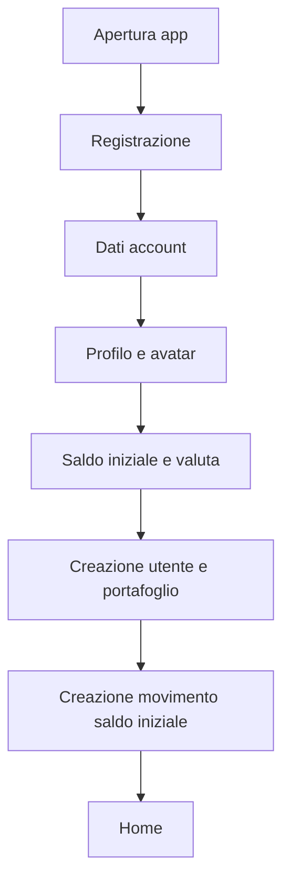
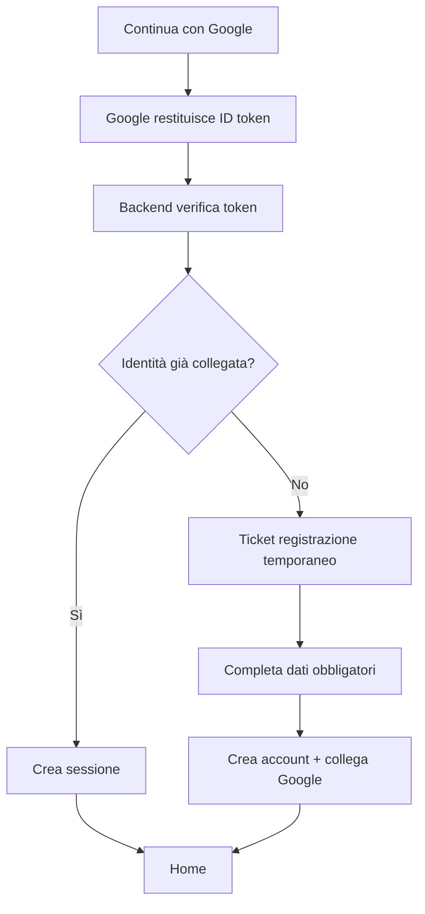
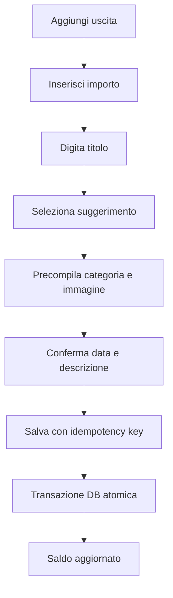
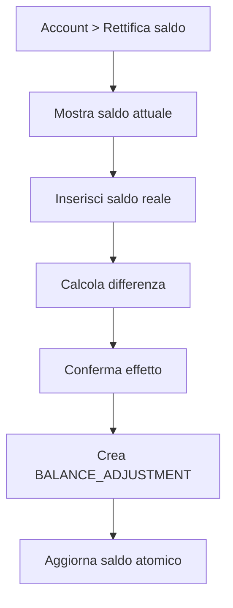

# Piano implementativo completo — App di gestione economica

**Versione:** 1.0  
**Data:** 18 luglio 2026  
**Stack previsto:** Flutter · Go · PostgreSQL · Redis · Docker  
**Porte host richieste:** PostgreSQL `10001` · Redis `10002` · API `10003`

---

## Indice

1. [Obiettivo del prodotto](#1-obiettivo-del-prodotto)
2. [Revisione critica della bozza iniziale](#2-revisione-critica-della-bozza-iniziale)
3. [Ambito MVP e funzionalità successive](#3-ambito-mvp-e-funzionalità-successive)
4. [Terminologia e regole di dominio](#4-terminologia-e-regole-di-dominio)
5. [Architettura informativa e navigazione](#5-architettura-informativa-e-navigazione)
6. [Design system e linee guida UI](#6-design-system-e-linee-guida-ui)
7. [Specifiche dettagliate delle schermate](#7-specifiche-dettagliate-delle-schermate)
8. [Flussi utente principali](#8-flussi-utente-principali)
9. [Architettura Flutter](#9-architettura-flutter)
10. [Architettura backend Go](#10-architettura-backend-go)
11. [Modello dati PostgreSQL](#11-modello-dati-postgresql)
12. [Ruolo di Redis](#12-ruolo-di-redis)
13. [Gestione affidabile del saldo](#13-gestione-affidabile-del-saldo)
14. [Contratto API REST](#14-contratto-api-rest)
15. [Autenticazione e collegamento Google](#15-autenticazione-e-collegamento-google)
16. [Gestione immagini, ricerca e crop](#16-gestione-immagini-ricerca-e-crop)
17. [Cronologia, ricerca e filtri](#17-cronologia-ricerca-e-filtri)
18. [Report, percentuali e grafici](#18-report-percentuali-e-grafici)
19. [Sicurezza](#19-sicurezza)
20. [Privacy e gestione dei dati](#20-privacy-e-gestione-dei-dati)
21. [Docker e ambienti](#21-docker-e-ambienti)
22. [Osservabilità, log e monitoraggio](#22-osservabilità-log-e-monitoraggio)
23. [Strategia di test](#23-strategia-di-test)
24. [CI/CD e rilascio](#24-cicd-e-rilascio)
25. [Roadmap implementativa](#25-roadmap-implementativa)
26. [Criteri di accettazione](#26-criteri-di-accettazione)
27. [Rischi e mitigazioni](#27-rischi-e-mitigazioni)
28. [Decisioni da confermare prima dello sviluppo](#28-decisioni-da-confermare-prima-dello-sviluppo)
29. [Struttura consigliata dei repository](#29-struttura-consigliata-dei-repository)
30. [Definition of Done](#30-definition-of-done)
31. [Riferimenti tecnici](#31-riferimenti-tecnici)

---

## 1. Obiettivo del prodotto

L’app deve consentire a una persona di gestire in modo semplice ma verificabile il proprio saldo, registrare entrate e uscite, ritrovare rapidamente le operazioni e comprendere l’andamento economico nel tempo.

Il prodotto deve avere quattro qualità principali:

1. **Rapidità:** inserire un movimento comune deve richiedere pochi secondi.
2. **Affidabilità:** ogni modifica che influenza il saldo deve essere tracciabile.
3. **Leggibilità:** saldo, entrate, uscite e andamento devono essere comprensibili senza conoscenze contabili.
4. **Estendibilità:** l’MVP deve poter evolvere verso più conti, ricorrenze automatiche, budget, esportazioni e sincronizzazioni bancarie senza riscrivere il nucleo.

### 1.1 Utenti target iniziali

- Persona che vuole sostituire note o fogli di calcolo con una soluzione mobile.
- Persona che registra manualmente spese e accrediti.
- Persona che vuole confrontare mesi e capire quali titoli o categorie incidono maggiormente.
- Persona che non necessita, nella prima versione, di collegamento automatico alla banca.

### 1.2 Principi di prodotto

- Il saldo mostrato deve essere sempre riconducibile a movimenti registrati.
- Le azioni distruttive devono essere reversibili o chiaramente confermate.
- PostgreSQL è la fonte autorevole dei dati finanziari.
- Redis non deve contenere l’unica copia di alcun dato finanziario.
- Gli importi non devono mai essere trattati con numeri floating point.
- Le date devono essere conservate in UTC e visualizzate nel fuso orario dell’utente.
- L’interfaccia deve distinguere entrate e uscite anche senza affidarsi esclusivamente al colore.

---

## 2. Revisione critica della bozza iniziale

La bozza contiene già il nucleo corretto del prodotto. Per renderla implementabile sono però necessarie alcune correzioni e integrazioni.

### 2.1 Modifiche necessarie

#### A. La modifica manuale del saldo diventa una “rettifica di saldo”

Non bisogna sovrascrivere direttamente un numero nel profilo, perché si perderebbe la spiegazione della differenza. Quando l’utente imposta un saldo differente, il sistema deve creare un movimento speciale:

- tipo tecnico: `BALANCE_ADJUSTMENT`;
- importo: differenza tra saldo attuale e saldo desiderato;
- titolo predefinito: “Rettifica saldo”;
- descrizione facoltativa ma consigliata;
- escluso per impostazione predefinita dai grafici di entrate e spese ordinarie;
- sempre visibile nella cronologia, con indicatore dedicato.

Esempio: saldo registrato €500, saldo reale €470. L’app crea una rettifica di `-€30`.

#### B. Aggiunta del concetto di categoria

Il titolo da solo non è sufficiente per report coerenti. “Bar Centrale”, “Caffè Roma” e “Colazione” potrebbero rappresentare la stessa categoria economica, ma titoli diversi.

Si aggiunge quindi una categoria, con valore predefinito “Altro”. Nei report l’utente potrà raggruppare:

- per **titolo/modello** — requisito originale;
- per **categoria** — vista più utile per l’analisi;
- in futuro per esercente, tag o conto.

#### C. Aggiunta dell’email alla registrazione manuale

L’email è necessaria per:

- recupero password;
- avvisi di sicurezza;
- verifica dell’identità;
- eventuale collegamento a Google;
- esportazione o cancellazione dell’account.

Campi registrazione aggiornati:

- nome;
- cognome;
- username;
- email;
- password;
- conferma password;
- immagine profilo o avatar generato;
- saldo iniziale;
- valuta;
- accettazione dei documenti richiesti dal prodotto.

#### D. Separazione tra “riuso di un titolo” e “ricorrenza automatica”

Il requisito descritto riguarda soprattutto l’autocompletamento di operazioni già usate. Nell’MVP verranno creati **modelli riutilizzabili**: selezionando un titolo precedente vengono precompilati categoria, immagine e dati abituali.

La creazione automatica mensile o settimanale di transazioni viene mantenuta come fase successiva, perché richiede notifiche, gestione degli errori, fusi orari e conferma delle operazioni pianificate.

#### E. Aggiunta di uno storage per le immagini

PostgreSQL e Redis non sono adatti a contenere direttamente tutti i file immagine. Il piano prevede:

- PostgreSQL per metadati e riferimenti;
- storage S3-compatible, preferibilmente MinIO in ambiente self-hosted, oppure bucket cloud in produzione;
- backend come unico punto autorizzato per upload, validazione e distribuzione iniziale.

MinIO può rimanere nella rete Docker interna senza una porta host pubblica. In alternativa, per un MVP molto piccolo, si può usare un volume persistente gestito dal backend, mantenendo la stessa interfaccia astratta.

#### F. Aggiunta delle operazioni di modifica ed eliminazione

Una cronologia utile deve permettere di correggere errori. Per ogni transazione sono previste:

- visualizzazione dettaglio;
- modifica;
- eliminazione logica;
- aggiornamento atomico del saldo;
- audit dell’azione.

#### G. Aggiunta di valuta e fuso orario

Anche con una sola valuta iniziale, ogni portafoglio deve avere un codice ISO, per esempio `EUR`. Il profilo conserva anche locale e fuso orario, per esempio `it-IT` e `Europe/Rome`.

#### H. Aggiunta di esportazione e cancellazione account

Sono funzionalità importanti per un’app che conserva dati finanziari personali:

- esportazione CSV/JSON;
- richiesta cancellazione account;
- cancellazione o anonimizzazione secondo la politica definita;
- revoca delle sessioni e scollegamento provider esterni.

### 2.2 Funzionalità non necessarie nell’MVP

Vengono rinviate per evitare di aumentare il rischio della prima release:

- sincronizzazione automatica con banche;
- gestione condivisa tra più utenti;
- più portafogli o conti per utente;
- conversione valutaria;
- budget avanzati;
- previsioni basate su intelligenza artificiale;
- riconoscimento automatico di ricevute;
- ricorrenze automatiche;
- importazione massiva da estratti conto.

L’architettura deve comunque evitare scelte che rendano queste funzionalità impossibili in seguito.

---

## 3. Ambito MVP e funzionalità successive

### 3.1 MVP obbligatorio

- Registrazione manuale completa.
- Login manuale.
- Accesso Google collegato a un account applicativo completo.
- Saldo iniziale non negativo.
- Portafoglio singolo in EUR, ma schema predisposto per altre valute.
- Home con saldo e ultimi movimenti.
- Inserimento accredito/addebito.
- Modelli riutilizzabili e suggerimenti dei titoli già usati.
- Categoria della transazione.
- Immagine da libreria già utilizzata.
- Ricerca immagine tramite provider configurato.
- Upload e crop immagine.
- Cronologia paginata.
- Filtri per titolo, importo, intervallo date, tipo e categoria.
- Dettaglio, modifica ed eliminazione di una transazione.
- Rettifica saldo.
- Report per ultimi 30 giorni, ultimi 12 mesi, intera cronologia e periodo personalizzato.
- Ripartizione per titolo e categoria.
- Confronto mensile quando il periodo comprende almeno due mesi.
- Modifica profilo e avatar.
- Collegamento e scollegamento Google.
- Logout dal dispositivo e logout da tutti i dispositivi.
- Esportazione dati.
- Cancellazione account.
- Tema chiaro e scuro.
- Localizzazione italiana; struttura pronta per altre lingue.

### 3.2 Fase successiva consigliata

- Ricorrenze automatiche o promemoria di operazioni ricorrenti.
- Budget mensili per categoria.
- Più conti/portafogli.
- Trasferimenti tra conti.
- Importazione CSV.
- Allegati multipli e ricevute.
- Notifiche push.
- Report esportabili in PDF.
- Widget home screen.
- Login con passkey.
- Sincronizzazione offline completa.

---

## 4. Terminologia e regole di dominio

### 4.1 Entità principali

- **Utente:** identità applicativa, indipendente dal metodo di autenticazione.
- **Credenziale locale:** password associata all’utente.
- **Identità esterna:** collegamento Google identificato dal `sub` verificato del token Google.
- **Portafoglio:** contenitore del saldo e dei movimenti. Nell’MVP ne esiste uno per utente.
- **Transazione:** movimento che modifica il saldo.
- **Modello transazione:** dati riutilizzabili per operazioni frequenti.
- **Categoria:** classificazione economica, per esempio “Casa”, “Trasporti”, “Stipendio”.
- **Asset multimediale:** immagine caricata, cercata o riutilizzata.
- **Rettifica:** transazione speciale usata per allineare il saldo.

### 4.2 Tipi di transazione

Direzione economica:

- `CREDIT`: aumenta il saldo;
- `DEBIT`: diminuisce il saldo.

Natura tecnica:

- `STANDARD`: normale entrata o uscita;
- `OPENING_BALANCE`: saldo iniziale;
- `BALANCE_ADJUSTMENT`: rettifica manuale;
- in futuro `TRANSFER`, `IMPORT`, `RECURRING_GENERATED`.

### 4.3 Regole per gli importi

- L’importo inserito dall’utente è sempre maggiore di zero.
- La direzione determina il segno applicato al saldo.
- Nel database l’importo viene salvato in unità minime, per esempio centesimi, come intero `BIGINT`.
- Esempio: `€12,34` viene salvato come `1234`.
- Il saldo iniziale deve essere `>= 0`.
- Dopo la registrazione, il saldo può diventare negativo a seguito di addebiti, salvo decisione di prodotto contraria.
- Il backend valida limiti massimi ragionevoli per evitare overflow o input anomali.

### 4.4 Regole per titolo e modello

- Titolo obbligatorio, lunghezza consigliata 1–120 caratteri.
- Viene conservato il testo originale per la visualizzazione.
- Viene calcolato anche un titolo normalizzato: trim, spazi compattati e confronto case-insensitive.
- Se una transazione deriva da un modello, il riferimento al modello è preferito per il raggruppamento.
- I suggerimenti sono ordinati per frequenza e utilizzo recente.
- Se l’utente modifica un campo dopo aver selezionato un modello, la transazione può divergere senza modificare automaticamente il modello.
- Dopo il salvataggio può essere offerta l’azione “Aggiorna anche il modello”.

### 4.5 Regole temporali

- `occurred_at`: data e ora effettiva dell’operazione, modificabile.
- `created_at`: momento di creazione del record.
- `updated_at`: ultima modifica.
- Tutte le date persistite sono `timestamptz` in UTC.
- Il client visualizza nel fuso del profilo.
- I filtri date devono avere semantica inclusiva e chiara.
- I periodi personalizzati vengono convertiti in intervalli UTC dal backend usando il fuso dell’utente.

---

## 5. Architettura informativa e navigazione

### 5.1 Navigazione primaria

Barra inferiore con quattro destinazioni e pulsante centrale:

1. **Home**
2. **Cronologia**
3. **Aggiungi** — pulsante centrale prominente
4. **Report**
5. **Account**

Il pulsante “Aggiungi” apre direttamente la schermata di inserimento. Una pressione prolungata o un bottom sheet può offrire due scorciatoie:

- Nuova uscita;
- Nuova entrata.

### 5.2 Gerarchia delle sezioni

```text
Autenticazione
├── Splash / ripristino sessione
├── Login
├── Registrazione
├── Completamento registrazione Google
├── Recupero password
└── Verifica email

Area autenticata
├── Home
│   ├── Saldo
│   ├── Riepilogo periodo
│   └── Operazioni recenti
├── Nuova operazione
│   ├── Selezione tipo
│   ├── Dati operazione
│   ├── Selezione immagine
│   └── Crop / anteprima
├── Cronologia
│   ├── Ricerca
│   ├── Filtri
│   └── Dettaglio / modifica
├── Report
│   ├── Periodo
│   ├── Riepilogo
│   ├── Ripartizione
│   └── Confronto mensile
└── Account
    ├── Profilo
    ├── Avatar
    ├── Saldo e rettifica
    ├── Sicurezza
    ├── Account collegati
    ├── Preferenze
    ├── Esportazione dati
    └── Cancellazione / logout
```

---

## 6. Design system e linee guida UI

### 6.1 Direzione visiva

Stile consigliato: **finanziario, calmo, affidabile, non bancario tradizionale**.

Caratteristiche:

- superfici pulite;
- numeri ben leggibili;
- gerarchia tipografica netta;
- uso moderato di card;
- icone semplici;
- animazioni brevi e funzionali;
- grafici comprensibili anche su schermi piccoli.

### 6.2 Material Design

Usare Material 3 come base, personalizzando token e componenti. Evitare di creare da zero comportamenti già risolti dal framework, come date picker, bottom sheet, snack bar e navigation bar.

### 6.3 Palette proposta

#### Tema chiaro

- Primary: `#176B5B`
- Primary container: `#D7F4EC`
- Background: `#F7F9F8`
- Surface: `#FFFFFF`
- Text primary: `#16201D`
- Text secondary: `#5C6965`
- Border: `#DCE4E1`
- Credit semantic: `#067647`
- Debit semantic: `#B42318`
- Warning: `#B54708`
- Info: `#175CD3`

#### Tema scuro

- Background: `#0E1513`
- Surface: `#17211E`
- Elevated surface: `#1F2B27`
- Text primary: `#F1F6F4`
- Text secondary: `#AAB8B3`
- Primary: `#65CDB5`

Entrate e uscite devono differire anche tramite icona, segno `+/-`, etichetta e posizione, non solo tramite verde e rosso.

### 6.4 Tipografia

- Display saldo: 36–44 sp, peso 700.
- Titolo pagina: 24–28 sp, peso 650–700.
- Titolo card: 16–18 sp, peso 600.
- Corpo: 14–16 sp.
- Dati secondari: 12–14 sp.
- Importi in elenco: cifre tabellari, allineate a destra.

### 6.5 Spaziatura e forme

- Griglia base: 4 px.
- Padding pagina: 16 px mobile, 24 px tablet.
- Spazi principali: 8, 12, 16, 24, 32 px.
- Raggio card: 16–20 px.
- Raggio input: 12–16 px.
- Touch target minimo: 48×48 px.

### 6.6 Componenti riutilizzabili

- `BalanceCard`
- `TransactionTile`
- `AmountField`
- `DirectionSegmentedControl`
- `PeriodSelector`
- `FilterChipGroup`
- `CategoryPicker`
- `MediaPickerTile`
- `EmptyState`
- `InlineError`
- `SkeletonList`
- `StatCard`
- `BreakdownChartCard`
- `MonthlyComparisonCard`
- `GeneratedAvatar`
- `ConfirmationSheet`

### 6.7 Accessibilità

- Supportare text scaling senza tagliare importi o pulsanti.
- Etichette semantiche per grafici e icone.
- Contrasto verificato per tema chiaro e scuro.
- Non usare il colore come unico indicatore.
- Permettere navigazione da tastiera su tablet/web, se il target viene incluso.
- Ridurre o disattivare animazioni quando richiesto dal sistema.
- Per ogni grafico fornire anche una sintesi testuale o tabellare.

---

## 7. Specifiche dettagliate delle schermate

## 7.1 Splash e ripristino sessione

### Obiettivo

Determinare rapidamente se mostrare login, onboarding o area autenticata.

### Contenuto

- Logo/app mark.
- Indicatore di caricamento discreto.
- Nessun dato finanziario mostrato finché la sessione non è validata.

### Comportamento

1. Leggere in modo sicuro refresh token e stato locale.
2. Tentare refresh sessione.
3. Caricare profilo e portafoglio.
4. Se il profilo non è completo, aprire il completamento registrazione.
5. In caso di rete assente, mostrare dati locali in modalità limitata solo se esiste una sessione precedentemente valida.

## 7.2 Login

### Campi

- Username o email.
- Password.
- Mostra/nascondi password.
- “Password dimenticata?”.
- Pulsante “Accedi”.
- Separatore “oppure”.
- Pulsante ufficiale “Continua con Google”.
- Link “Crea un account”.

### Stati

- Validazione inline.
- Caricamento nel pulsante.
- Credenziali errate con messaggio non eccessivamente specifico.
- Account non verificato con azione per reinviare email.
- Rate limit con messaggio e tempo di riprova.

## 7.3 Registrazione manuale

Per evitare una pagina eccessivamente lunga, usare un flusso in tre passi.

### Passo 1 — Account

- Nome.
- Cognome.
- Username.
- Email.
- Password.
- Conferma password.

Validazioni:

- username univoco e normalizzato;
- email valida e univoca;
- password conforme alla policy;
- conferma identica.

### Passo 2 — Profilo

- Anteprima avatar generato.
- Scelta immagine personalizzata.
- Colore sfondo avatar.
- Colore testo avatar.
- Tema iniziale facoltativo.

L’avatar generato non viene salvato come file. Nel database vengono salvati solo modalità e colori.

### Passo 3 — Portafoglio

- Saldo iniziale.
- Valuta, predefinita EUR.
- Fuso orario rilevato, modificabile.
- Riepilogo dati.
- Conferma registrazione.

Il saldo iniziale crea una transazione `OPENING_BALANCE` e inizializza il saldo corrente nella stessa transazione database.

## 7.4 Registrazione con Google

Google è un metodo di prova dell’identità, non sostituisce il profilo applicativo.

Flusso:

1. Autenticazione Google sul dispositivo.
2. Invio ID token al backend.
3. Verifica server-side del token.
4. Se l’identità è già collegata, login immediato.
5. Se non è collegata, creazione di un ticket temporaneo di registrazione.
6. Apertura della registrazione con nome, cognome ed email precompilati quando disponibili.
7. Richiesta di username, eventuale password locale, avatar, saldo iniziale, valuta e consensi.
8. Creazione account e collegamento atomico dell’identità Google.

La password locale può essere opzionale solo se il prodotto accetta account esclusivamente federati. Per ridurre il rischio di lockout dopo lo scollegamento, il piano consigliato richiede di impostare una password prima di poter scollegare l’unico provider esterno.

## 7.5 Home

### Layout proposto

```text
┌──────────────────────────────────────┐
│ Ciao, Mario                     [●]  │
│                                      │
│  Saldo disponibile                   │
│  € 2.430,50                  [occhio]│
│  aggiornato ora                      │
│                                      │
│  [+ Entrata]       [- Uscita]        │
├──────────────────────────────────────┤
│ Questo mese                          │
│ Entrate €2.100   Uscite €1.240       │
│ Netto +€860                          │
├──────────────────────────────────────┤
│ Ultime operazioni          Vedi tutte│
│ ● Stipendio               +€2.000    │
│ ● Bar Centrale               -€4,50  │
│ ● Benzina                    -€60,00  │
└──────────────────────────────────────┘
```

### Componenti

- Saluto e avatar.
- Card saldo con possibilità di nascondere il valore.
- Azioni rapide entrata/uscita.
- Mini riepilogo del mese corrente.
- Ultime 5–10 transazioni.
- Eventuale banner non invasivo per completare verifica email o backup.

### Interazioni

- Tap saldo: dettaglio portafoglio e rettifica.
- Tap operazione: dettaglio.
- Swipe opzionale sull’operazione: modifica/elimina, solo dopo validazione UX.
- Pull-to-refresh.

## 7.6 Nuova operazione

### Struttura

1. Segmento “Uscita / Entrata”.
2. Campo importo prominente.
3. Titolo con autocomplete.
4. Categoria.
5. Data e ora.
6. Immagine/icona.
7. Descrizione facoltativa.
8. Toggle facoltativo “Salva/Aggiorna modello”.
9. Pulsante “Salva operazione”.

### Comportamento titolo

- Dopo 1–2 caratteri mostrare suggerimenti.
- Ogni suggerimento mostra titolo, categoria, immagine e ultimo utilizzo.
- Selezionando un suggerimento vengono precompilati i valori associati.
- I suggerimenti sono filtrati per direzione: modelli di uscita per uscite, di entrata per entrate.
- L’utente può comunque cambiare ogni campo.

### Importo

- Tastiera numerica.
- Formattazione locale durante la digitazione.
- Nessun segno negativo manuale.
- Cambio direzione tramite controllo dedicato.
- Conferma visiva: `+ €` o `- €`.

### Salvataggio

- Il pulsante resta disabilitato finché importo e titolo non sono validi.
- Il client genera un `Idempotency-Key` univoco.
- Durante il salvataggio impedire doppi tap.
- Dopo successo mostrare feedback e tornare alla schermata precedente.
- Opzione “Aggiungi un’altra” nel messaggio di successo.

## 7.7 Selettore immagine

Bottom sheet o pagina con quattro tab:

1. **Recenti** — immagini già usate di recente.
2. **Libreria** — tutte le immagini salvate dall’utente.
3. **Cerca** — risultati del provider configurato.
4. **Carica** — fotocamera o galleria.

Ogni immagine deve mostrare stato di selezione, eventuale provenienza e azione di anteprima.

## 7.8 Crop immagine

### Profilo

- Crop 1:1.
- Maschera circolare in anteprima, ma file risultante quadrato.
- Zoom e trascinamento.
- Rotazione facoltativa.
- Output consigliato: 512×512.

### Operazione

- Crop 1:1.
- Anteprima nel componente reale della transazione.
- Output consigliato: 256×256 o 512×512.

### Regole

- Se l’immagine è già compatibile, offrire comunque anteprima ma non obbligare a modifiche.
- Se è più grande o con rapporto incompatibile, aprire il crop.
- Il backend deve comunque ri-decodificare e ricodificare il file, senza fidarsi del risultato client.

## 7.9 Cronologia

### Header

- Titolo “Cronologia”.
- Barra ricerca testuale.
- Pulsante filtri con badge del numero di filtri attivi.
- Ordinamento, predefinito “Più recenti”.

### Lista

- Raggruppata per giorno.
- Totale netto del giorno facoltativo.
- Infinite scroll o paginazione cursor-based.
- Ogni riga mostra immagine, titolo, categoria, ora e importo.
- Rettifiche e saldo iniziale hanno stile dedicato.

### Filtri

- Titolo testuale.
- Importo minimo.
- Importo massimo.
- Data iniziale.
- Data finale.
- Tipo: tutte, uscite, entrate, rettifiche.
- Categoria.
- Con/senza immagine, facoltativo.
- Ordinamento per data o importo.

### UX dei filtri

- Bottom sheet a piena altezza.
- Azioni “Azzera” e “Applica”.
- Chip riepilogativi sopra la lista.
- Persistenza dei filtri finché la schermata resta aperta.
- Stato vuoto specifico: “Nessuna operazione corrisponde ai filtri”.

## 7.10 Dettaglio operazione

Contenuti:

- immagine;
- titolo;
- importo e direzione;
- categoria;
- data e ora effettiva;
- descrizione;
- data creazione e ultima modifica, in sezione secondaria;
- origine: manuale, rettifica, saldo iniziale;
- azioni modifica ed elimina.

Eliminazione:

- bottom sheet di conferma;
- indicazione del saldo risultante;
- soft delete;
- possibilità di annullamento immediato, quando tecnicamente possibile.

## 7.11 Modifica operazione

Riutilizza il form di inserimento. Il backend calcola la differenza tra vecchio e nuovo impatto sul saldo nella stessa transazione database.

Concorrenza:

- il record include una `version`;
- il client invia la versione letta;
- in caso di conflitto riceve `409 Conflict` e propone di ricaricare i dati.

## 7.12 Report

### Header periodo

Preset:

- Ultimi 30 giorni.
- Ultimi 12 mesi.
- Intera cronologia.
- Personalizzato.

Opzionalmente aggiungere “Mese corrente” e “Anno corrente”, con nomi non ambigui.

### Sezione riepilogo

- Saldo iniziale del periodo.
- Totale entrate ordinarie.
- Totale uscite ordinarie.
- Risultato netto.
- Saldo finale.
- Numero operazioni.
- Tasso di risparmio, solo quando le entrate sono positive.

### Grafico andamento

- Linea del saldo cumulativo oppure barre entrate/uscite per giorno o mese.
- Granularità automatica:
  - fino a 45 giorni: giornaliera;
  - 46–400 giorni: mensile;
  - oltre: mensile o annuale.

### Ripartizione

Due tab:

- Per titolo/modello.
- Per categoria.

Per le uscite mostrare donut o barre ordinate con percentuali. Per le entrate utilizzare una vista separata, evitando di mescolare i due denominatori.

### Confronto mensile

Mostrare solo se l’intervallo include almeno due mesi distinti.

- barre affiancate entrate/uscite;
- linea o indicatore del netto;
- tap su un mese per vedere il dettaglio;
- tabella accessibile sotto il grafico.

## 7.13 Account

Sezioni:

### Profilo

- Nome.
- Cognome.
- Username.
- Email e stato verifica.
- Avatar.

### Portafoglio

- Saldo corrente.
- Valuta.
- Rettifica saldo.
- In futuro gestione conti.

### Sicurezza

- Cambio password.
- Sessioni attive.
- Logout da tutti i dispositivi.
- Eventuale passkey in futuro.

### Account collegati

- Google collegato/non collegato.
- Collega.
- Scollega.
- Data ultimo utilizzo.

### Preferenze

- Tema sistema/chiaro/scuro.
- Fuso orario.
- Lingua.
- Visibilità saldo all’apertura.
- Primo giorno della settimana.

### Dati

- Esporta CSV.
- Esporta JSON.
- Elimina account.

### Sessione

- Logout.

## 7.14 Avatar generato

Il client genera l’avatar usando:

- iniziale del nome;
- iniziale del cognome;
- colore sfondo salvato;
- colore testo salvato.

Se nome o cognome cambia, le iniziali cambiano automaticamente. Non viene salvato alcun file finché l’utente mantiene la modalità generata.

## 7.15 Stati trasversali

Ogni schermata deve avere:

- loading iniziale;
- aggiornamento non bloccante;
- errore recuperabile;
- errore non recuperabile;
- stato vuoto;
- rete assente;
- sessione scaduta;
- permesso fotocamera/galleria negato.

---

## 8. Flussi utente principali

### 8.1 Prima registrazione manuale



### 8.2 Registrazione o login Google



### 8.3 Inserimento operazione ricorrente



### 8.4 Rettifica saldo



---

## 9. Architettura Flutter

### 9.1 Approccio

Adottare una struttura **feature-first** con separazione tra UI, dominio e dati. Il modello può essere descritto come MVVM con repository e servizi.

Principi:

- stato UI immutabile;
- flusso dati unidirezionale;
- view senza logica di business;
- repository come fonte dei dati per la feature;
- use case per operazioni che combinano più repository o regole;
- dipendenze iniettate;
- modelli API separati dai modelli di dominio.

### 9.2 Stack Flutter consigliato

Le versioni devono essere fissate nel lockfile e aggiornate tramite processo controllato.

- State management e dependency injection: `flutter_riverpod` oppure alternativa approvata tramite ADR.
- Routing dichiarativo: `go_router`.
- HTTP: `dio` o client generato da OpenAPI.
- Serializzazione: `json_serializable` e modelli immutabili.
- Storage sicuro token: wrapper su Keychain/Keystore, per esempio `flutter_secure_storage`.
- Database locale/cache: `drift` su SQLite, se viene implementata la cache persistente.
- Immagini: `image_picker` più libreria crop valutata con spike.
- Grafici: libreria con supporto touch e accessibilità, per esempio `fl_chart`.
- Localizzazione: `flutter_localizations` e file ARB.
- Logging/crash reporting: astrazione indipendente dal provider.

### 9.3 Struttura cartelle client

```text
lib/
├── app/
│   ├── app.dart
│   ├── bootstrap.dart
│   ├── router.dart
│   ├── theme/
│   └── localization/
├── core/
│   ├── api/
│   ├── auth/
│   ├── errors/
│   ├── formatting/
│   ├── storage/
│   ├── widgets/
│   └── observability/
├── features/
│   ├── authentication/
│   │   ├── data/
│   │   ├── domain/
│   │   └── presentation/
│   ├── home/
│   ├── transactions/
│   ├── history/
│   ├── reports/
│   ├── media/
│   └── account/
└── main.dart
```

Ogni feature:

```text
feature/
├── data/
│   ├── dto/
│   ├── services/
│   └── repositories/
├── domain/
│   ├── models/
│   ├── repositories/
│   └── use_cases/
└── presentation/
    ├── screens/
    ├── view_models/
    ├── state/
    └── widgets/
```

### 9.4 Gestione stato

Separare:

- stato server/cache: profilo, portafoglio, transazioni, report;
- stato effimero: valori dei form, tab selezionata, crop;
- stato globale minimo: sessione, tema, locale.

Non conservare il saldo come stato globale modificabile dal client. Dopo una mutazione, usare la risposta autorevole del backend e invalidare le query correlate.

### 9.5 Networking

Il client deve includere:

- base URL per ambiente;
- timeout differenziati;
- interceptor per access token;
- refresh token serializzato, evitando richieste refresh concorrenti;
- correlation/request ID;
- mapping errori API → errori di dominio;
- retry solo per richieste idempotenti o protette da idempotency key;
- cancellazione richieste quando una schermata viene chiusa.

### 9.6 Cache e modalità offline

MVP consigliato:

- cache locale cifrata o protetta per home e cronologia recente;
- lettura offline dei dati già sincronizzati;
- creazione/modifica transazioni solo online;
- indicatore chiaro dei dati potenzialmente non aggiornati.

Fase successiva:

- coda locale di mutazioni;
- UUID creati dal client;
- idempotency key;
- strategia di conflitto;
- sincronizzazione in background.

### 9.7 Formattazione importi

Creare un tipo di dominio `Money`:

```text
Money {
  minorUnits: int64
  currency: String
}
```

Il client non deve inviare `12.34` come floating point. Il contratto API può usare:

```json
{
  "amount_minor": 1234,
  "currency": "EUR"
}
```

### 9.8 Routing e guardie

Route principali:

```text
/splash
/login
/register
/register/google-completion
/forgot-password
/app/home
/app/transactions/new
/app/transactions/:id
/app/transactions/:id/edit
/app/history
/app/reports
/app/account
/app/account/profile
/app/account/security
/app/account/linked-accounts
/app/account/data
```

Guardie:

- non autenticato → login;
- autenticato ma profilo incompleto → completamento;
- autenticato e completo → area app;
- refresh fallito → logout locale controllato.

---

## 10. Architettura backend Go

### 10.1 Stile architetturale

Usare un **modular monolith**. È più semplice da distribuire e testare rispetto a microservizi, ma mantiene moduli separati.

Moduli:

- auth;
- users;
- wallets;
- transactions;
- templates;
- categories;
- media;
- reports;
- exports;
- audit.

### 10.2 Layer

```text
HTTP Handler
    ↓
Application Service / Use Case
    ↓
Domain Rules
    ↓
Repository Interfaces
    ↓
PostgreSQL / Redis / Object Storage / Provider esterni
```

### 10.3 Struttura backend

```text
cmd/
├── api/main.go
├── worker/main.go
└── migrate/main.go
internal/
├── platform/
│   ├── config/
│   ├── database/
│   ├── redis/
│   ├── httpserver/
│   ├── auth/
│   ├── storage/
│   ├── observability/
│   └── clock/
├── auth/
├── users/
├── wallets/
├── transactions/
├── templates/
├── categories/
├── media/
├── reports/
├── exports/
└── audit/
migrations/
openapi/
tests/
Dockerfile
compose.yaml
```

### 10.4 Librerie consigliate

- HTTP: `net/http` con router leggero, per esempio `chi`, oppure framework approvato.
- PostgreSQL: `pgx` e pool di connessioni.
- Redis: `go-redis`.
- Migrazioni: `goose`, `golang-migrate` o equivalente.
- Validazione: libreria con regole esplicite più validazioni di dominio.
- Password: `golang.org/x/crypto/argon2` con formato versionato.
- Log: `log/slog` strutturato.
- Telemetria: OpenTelemetry.
- UUID: UUID v7 quando disponibile e validato, altrimenti UUID v4.

### 10.5 Configurazione

Configurazione da variabili ambiente, validata all’avvio:

```text
APP_ENV
HTTP_ADDR
DATABASE_URL
REDIS_ADDR
REDIS_PASSWORD
OBJECT_STORAGE_ENDPOINT
OBJECT_STORAGE_BUCKET
OBJECT_STORAGE_ACCESS_KEY
OBJECT_STORAGE_SECRET_KEY
GOOGLE_CLIENT_IDS
JWT_SIGNING_KEY / SESSION_SECRET
ACCESS_TOKEN_TTL
REFRESH_TOKEN_TTL
IMAGE_SEARCH_PROVIDER
IMAGE_SEARCH_API_KEY
MAX_UPLOAD_BYTES
ALLOWED_IMAGE_TYPES
```

Nessun segreto nel repository o nelle immagini Docker.

### 10.6 Error model

Formato uniforme:

```json
{
  "error": {
    "code": "TRANSACTION_VERSION_CONFLICT",
    "message": "L'operazione è stata modificata da un'altra sessione.",
    "field_errors": {
      "amount_minor": "Deve essere maggiore di zero"
    },
    "request_id": "..."
  }
}
```

Il messaggio è localizzabile lato client attraverso `code`; il backend può fornire un fallback.

### 10.7 Idempotenza

Endpoint mutanti critici, soprattutto creazione transazioni e rettifiche, devono accettare:

```http
Idempotency-Key: <uuid>
```

La chiave è unica per utente ed endpoint. La risposta della prima esecuzione viene riutilizzata per richieste duplicate entro la finestra definita.

### 10.8 Job asincroni

Il worker è utile per:

- generazione varianti immagini;
- esportazioni grandi;
- cancellazione differita account;
- pulizia asset inutilizzati;
- invio email;
- futura generazione ricorrenze.

Per l’MVP il worker può essere un secondo comando dello stesso repository e della stessa immagine Docker.

---

## 11. Modello dati PostgreSQL

### 11.1 Principi

- PostgreSQL è la fonte di verità.
- Chiavi UUID.
- Importi in `BIGINT` minor units.
- Timestamp con fuso.
- Vincoli database oltre alla validazione applicativa.
- Soft delete per dati finanziari, seguito da cancellazione definitiva secondo policy.
- Indici progettati sui filtri reali.

### 11.2 Tabella `users`

Campi principali:

```text
id UUID PK
first_name VARCHAR(80) NOT NULL
last_name VARCHAR(80) NOT NULL
username VARCHAR(40) NOT NULL
username_normalized VARCHAR(40) NOT NULL UNIQUE
email VARCHAR(320) NOT NULL
email_normalized VARCHAR(320) NOT NULL UNIQUE
email_verified_at TIMESTAMPTZ NULL
avatar_mode VARCHAR(20) NOT NULL  -- generated/custom
avatar_media_id UUID NULL
avatar_background_color CHAR(7) NOT NULL
avatar_text_color CHAR(7) NOT NULL
locale VARCHAR(16) NOT NULL DEFAULT 'it-IT'
timezone VARCHAR(64) NOT NULL DEFAULT 'Europe/Rome'
theme VARCHAR(16) NOT NULL DEFAULT 'system'
status VARCHAR(20) NOT NULL DEFAULT 'active'
created_at TIMESTAMPTZ NOT NULL
updated_at TIMESTAMPTZ NOT NULL
deleted_at TIMESTAMPTZ NULL
version BIGINT NOT NULL DEFAULT 1
```

Vincoli:

- `avatar_mode` in insieme consentito;
- colori in formato esadecimale;
- se `avatar_mode=custom`, `avatar_media_id` non nullo;
- se `generated`, il media può essere nullo.

### 11.3 Tabella `password_credentials`

```text
user_id UUID PK FK users
password_hash TEXT NOT NULL
password_algorithm VARCHAR(32) NOT NULL
password_updated_at TIMESTAMPTZ NOT NULL
failed_attempts INT NOT NULL DEFAULT 0
locked_until TIMESTAMPTZ NULL
```

Il contatore può essere integrato o sostituito dal rate limit Redis, ma il blocco di sicurezza persistente non deve dipendere esclusivamente da Redis.

### 11.4 Tabella `external_identities`

```text
id UUID PK
user_id UUID NOT NULL FK users
provider VARCHAR(32) NOT NULL
provider_subject VARCHAR(255) NOT NULL
provider_email VARCHAR(320) NULL
provider_email_verified BOOLEAN NULL
linked_at TIMESTAMPTZ NOT NULL
last_used_at TIMESTAMPTZ NULL
UNIQUE(provider, provider_subject)
UNIQUE(user_id, provider)
```

Il vincolo garantisce che un account Google sia collegato a un solo account applicativo e che un utente abbia al massimo un collegamento per provider.

### 11.5 Tabella `sessions`

```text
id UUID PK
user_id UUID NOT NULL FK users
refresh_token_hash BYTEA NOT NULL UNIQUE
device_name VARCHAR(160) NULL
platform VARCHAR(40) NULL
ip_hash BYTEA NULL
user_agent_hash BYTEA NULL
created_at TIMESTAMPTZ NOT NULL
last_used_at TIMESTAMPTZ NOT NULL
expires_at TIMESTAMPTZ NOT NULL
revoked_at TIMESTAMPTZ NULL
replaced_by_session_id UUID NULL
```

Non salvare refresh token in chiaro.

### 11.6 Tabella `wallets`

```text
id UUID PK
user_id UUID NOT NULL FK users
name VARCHAR(80) NOT NULL DEFAULT 'Portafoglio principale'
currency CHAR(3) NOT NULL DEFAULT 'EUR'
current_balance_minor BIGINT NOT NULL
created_at TIMESTAMPTZ NOT NULL
updated_at TIMESTAMPTZ NOT NULL
version BIGINT NOT NULL DEFAULT 1
archived_at TIMESTAMPTZ NULL
UNIQUE(user_id) WHERE archived_at IS NULL  -- regola MVP
```

Il saldo corrente è un valore denormalizzato mantenuto in transazione. La possibilità di ricalcolarlo dal ledger deve essere disponibile come controllo amministrativo.

### 11.7 Tabella `categories`

```text
id UUID PK
owner_user_id UUID NULL
name VARCHAR(80) NOT NULL
name_normalized VARCHAR(80) NOT NULL
direction_scope VARCHAR(16) NOT NULL  -- debit/credit/both
icon_media_id UUID NULL
color CHAR(7) NULL
is_system BOOLEAN NOT NULL DEFAULT FALSE
sort_order INT NOT NULL DEFAULT 0
created_at TIMESTAMPTZ NOT NULL
updated_at TIMESTAMPTZ NOT NULL
archived_at TIMESTAMPTZ NULL
```

Categorie iniziali suggerite:

Uscite: Casa, Alimentari, Ristorazione, Trasporti, Carburante, Abbonamenti, Salute, Svago, Acquisti, Imposte, Altro.  
Entrate: Stipendio, Rimborso, Regalo, Vendita, Interessi, Altro.

### 11.8 Tabella `media_assets`

```text
id UUID PK
owner_user_id UUID NOT NULL FK users
kind VARCHAR(24) NOT NULL  -- profile/transaction/category
source VARCHAR(24) NOT NULL -- upload/search/generated-import
source_provider VARCHAR(40) NULL
source_external_id VARCHAR(255) NULL
source_attribution TEXT NULL
object_key TEXT NOT NULL UNIQUE
original_filename TEXT NULL
mime_type VARCHAR(80) NOT NULL
width INT NOT NULL
height INT NOT NULL
size_bytes BIGINT NOT NULL
sha256 BYTEA NOT NULL
status VARCHAR(24) NOT NULL -- processing/ready/rejected/deleted
created_at TIMESTAMPTZ NOT NULL
last_used_at TIMESTAMPTZ NULL
deleted_at TIMESTAMPTZ NULL
```

Possibile indice deduplicazione per utente e hash.

### 11.9 Tabella `transaction_templates`

```text
id UUID PK
user_id UUID NOT NULL FK users
direction VARCHAR(8) NOT NULL
title VARCHAR(120) NOT NULL
title_normalized VARCHAR(120) NOT NULL
default_category_id UUID NULL
default_media_id UUID NULL
default_description TEXT NULL
usage_count BIGINT NOT NULL DEFAULT 0
last_used_at TIMESTAMPTZ NULL
created_at TIMESTAMPTZ NOT NULL
updated_at TIMESTAMPTZ NOT NULL
archived_at TIMESTAMPTZ NULL
UNIQUE(user_id, direction, title_normalized) WHERE archived_at IS NULL
```

### 11.10 Tabella `transactions`

```text
id UUID PK
wallet_id UUID NOT NULL FK wallets
user_id UUID NOT NULL FK users
direction VARCHAR(8) NOT NULL
kind VARCHAR(32) NOT NULL
amount_minor BIGINT NOT NULL CHECK (amount_minor > 0)
currency CHAR(3) NOT NULL
title VARCHAR(120) NOT NULL
title_normalized VARCHAR(120) NOT NULL
description TEXT NULL
category_id UUID NULL
template_id UUID NULL
media_id UUID NULL
occurred_at TIMESTAMPTZ NOT NULL
created_at TIMESTAMPTZ NOT NULL
updated_at TIMESTAMPTZ NOT NULL
deleted_at TIMESTAMPTZ NULL
version BIGINT NOT NULL DEFAULT 1
created_by_session_id UUID NULL
idempotency_key UUID NULL
metadata JSONB NOT NULL DEFAULT '{}'
UNIQUE(user_id, idempotency_key) WHERE idempotency_key IS NOT NULL
```

Vincoli applicativi e database:

- currency uguale a quella del portafoglio nell’MVP;
- `OPENING_BALANCE` solo credit e una sola volta per portafoglio;
- `BALANCE_ADJUSTMENT` può essere credit o debit;
- titolo e importo obbligatori;
- una transazione eliminata non contribuisce al saldo.

### 11.11 Tabella `transaction_audit_events`

```text
id UUID PK
transaction_id UUID NOT NULL
user_id UUID NOT NULL
action VARCHAR(24) NOT NULL -- created/updated/deleted/restored
before_data JSONB NULL
after_data JSONB NULL
created_at TIMESTAMPTZ NOT NULL
request_id UUID NULL
```

Limitare i dati duplicati e non includere segreti. La retention deve essere definita.

### 11.12 Tabella `idempotency_records`

```text
user_id UUID NOT NULL
endpoint VARCHAR(160) NOT NULL
key UUID NOT NULL
request_hash BYTEA NOT NULL
response_status INT NOT NULL
response_body JSONB NOT NULL
created_at TIMESTAMPTZ NOT NULL
expires_at TIMESTAMPTZ NOT NULL
PRIMARY KEY(user_id, endpoint, key)
```

### 11.13 Indici principali

```text
transactions(user_id, occurred_at DESC, id DESC) WHERE deleted_at IS NULL
transactions(user_id, direction, occurred_at DESC) WHERE deleted_at IS NULL
transactions(user_id, category_id, occurred_at DESC) WHERE deleted_at IS NULL
transactions(user_id, title_normalized, occurred_at DESC) WHERE deleted_at IS NULL
transactions(wallet_id, occurred_at) WHERE deleted_at IS NULL
transaction_templates(user_id, direction, last_used_at DESC)
media_assets(owner_user_id, last_used_at DESC) WHERE deleted_at IS NULL
sessions(user_id, expires_at) WHERE revoked_at IS NULL
```

Per ricerca testuale avanzata si può aggiungere trigram index PostgreSQL in una fase successiva. Per l’MVP, prefix search sul titolo normalizzato è sufficiente.

---

## 12. Ruolo di Redis

Redis deve essere un acceleratore e un coordinatore, non il ledger finanziario.

### 12.1 Usi previsti

- Rate limiting login, reset password, upload e API.
- Cache report costosi.
- Cache suggerimenti titoli, se necessario.
- Revoca rapida o deny-list temporanea token.
- Lock breve per elaborazione immagini duplicate.
- Job queue, se si adotta una libreria compatibile.
- Nonce e ticket temporanei per registrazione Google.

### 12.2 Chiavi indicative

```text
ratelimit:login:ip:<hash>
ratelimit:login:user:<normalized>
ratelimit:api:user:<user_id>
auth:google-registration:<token_hash>
cache:report:<user_id>:<wallet_id>:<query_hash>
cache:suggestions:<user_id>:<direction>:<prefix>
lock:media:<sha256>
revoked:jti:<jti>
```

### 12.3 TTL

- Rate limit: da minuti a ore secondo la policy.
- Ticket Google: 5–15 minuti.
- Report: 1–10 minuti, invalidati dopo mutazioni.
- Suggerimenti: breve TTL.
- Revoche: fino alla scadenza del token.

### 12.4 Cosa non mettere in Redis come unica copia

- saldo;
- transazioni;
- profilo;
- collegamenti Google;
- hash password;
- metadati permanenti immagini;
- audit.

---

## 13. Gestione affidabile del saldo

### 13.1 Fonte del saldo

Il ledger delle transazioni è la fonte logica. `wallets.current_balance_minor` è una proiezione denormalizzata per letture rapide.

### 13.2 Creazione transazione

Pseudo-flusso:

```text
BEGIN;
SELECT wallet FOR UPDATE;
validate ownership and currency;
insert transaction;
compute signed delta;
update wallet balance and version;
insert audit event;
COMMIT;
```

Delta:

```text
CREDIT => +amount_minor
DEBIT  => -amount_minor
```

La risposta deve includere:

- transazione creata;
- nuovo saldo;
- nuova versione portafoglio.

### 13.3 Modifica transazione

1. Lock portafoglio.
2. Leggere transazione non eliminata.
3. Verificare versione.
4. Calcolare impatto precedente.
5. Calcolare nuovo impatto.
6. Applicare `newImpact - oldImpact` al saldo.
7. Aggiornare record e audit.
8. Commit.

### 13.4 Eliminazione transazione

1. Lock portafoglio.
2. Verificare proprietà e versione.
3. Applicare al saldo il contrario dell’impatto originale.
4. Impostare `deleted_at`.
5. Scrivere audit.
6. Commit.

Il saldo iniziale non dovrebbe essere eliminabile dalla UI ordinaria; deve essere modificato tramite rettifica o procedura amministrativa controllata.

### 13.5 Rettifica saldo

Input:

```json
{
  "target_balance_minor": 47000,
  "reason": "Allineamento con saldo reale",
  "occurred_at": "...",
  "idempotency_key": "..."
}
```

Il backend calcola la differenza all’interno della transazione dopo aver bloccato il portafoglio. Il client non invia il delta come valore autorevole.

### 13.6 Riconciliazione

Aggiungere un comando amministrativo o job:

```text
recalculated_balance = somma di tutte le transazioni non eliminate
```

Confrontare il risultato con `current_balance_minor`. In caso di differenza:

- generare alert;
- non correggere automaticamente senza audit;
- fornire comando controllato di riparazione.

### 13.7 Concorrenza

- Lock pessimista sul portafoglio per mutazioni del saldo.
- Versione ottimistica su transazioni e profilo.
- Idempotenza per retry di rete.
- Livello di isolamento PostgreSQL predefinito sufficiente con lock esplicito; valutare serializable per operazioni amministrative specifiche.

---

## 14. Contratto API REST

Prefisso: `/v1`  
Formato: JSON, salvo upload/download.  
Documentazione: OpenAPI.

### 14.1 Auth

```http
POST /v1/auth/register
POST /v1/auth/login
POST /v1/auth/refresh
POST /v1/auth/logout
POST /v1/auth/logout-all
POST /v1/auth/password/forgot
POST /v1/auth/password/reset
POST /v1/auth/email/verify
POST /v1/auth/email/resend-verification
POST /v1/auth/google/verify
POST /v1/auth/google/complete-registration
```

### 14.2 Profilo

```http
GET    /v1/me
PATCH  /v1/me
DELETE /v1/me
GET    /v1/me/sessions
DELETE /v1/me/sessions/{session_id}
POST   /v1/me/export
GET    /v1/me/export/{export_id}
```

### 14.3 Identità collegate

```http
GET    /v1/me/identities
POST   /v1/me/identities/google/link
DELETE /v1/me/identities/google
```

Per link e unlink richiedere autenticazione recente.

### 14.4 Portafoglio

```http
GET  /v1/wallet
POST /v1/wallet/balance-adjustments
```

Risposta `GET /wallet`:

```json
{
  "id": "...",
  "name": "Portafoglio principale",
  "currency": "EUR",
  "current_balance_minor": 243050,
  "version": 42,
  "updated_at": "..."
}
```

### 14.5 Transazioni

```http
GET    /v1/transactions
POST   /v1/transactions
GET    /v1/transactions/{id}
PATCH  /v1/transactions/{id}
DELETE /v1/transactions/{id}
POST   /v1/transactions/{id}/restore   -- opzionale
```

Parametri lista:

```text
cursor
limit
direction
kind
category_id
title
amount_min_minor
amount_max_minor
occurred_from
occurred_to
sort
```

Usare cursor pagination basata su `occurred_at` e `id`.

### 14.6 Suggerimenti e modelli

```http
GET    /v1/transaction-templates?direction=DEBIT&q=bar&limit=10
POST   /v1/transaction-templates
PATCH  /v1/transaction-templates/{id}
DELETE /v1/transaction-templates/{id}
```

La creazione di una transazione può includere:

```json
{
  "template_behavior": "use_existing|create_or_update|none"
}
```

In alternativa, mantenere il contratto più semplice e gestire il modello con endpoint separato dopo il salvataggio.

### 14.7 Categorie

```http
GET  /v1/categories
POST /v1/categories
PATCH /v1/categories/{id}
DELETE /v1/categories/{id}
```

Le categorie di sistema non sono eliminabili; possono essere nascoste.

### 14.8 Media

```http
GET    /v1/media?kind=transaction&sort=recent
GET    /v1/media/search?q=coffee&page=1
POST   /v1/media/uploads
GET    /v1/media/{id}
DELETE /v1/media/{id}
```

Upload MVP: `multipart/form-data` al backend.  
Evoluzione: upload diretto con URL firmato e callback di completamento.

### 14.9 Report

```http
GET /v1/reports/summary
GET /v1/reports/timeseries
GET /v1/reports/breakdown
GET /v1/reports/monthly-comparison
```

Parametri comuni:

```text
from
to
timezone
group_by=title|template|category
include_adjustments=false
```

È possibile anche creare un singolo endpoint aggregato `/v1/reports/dashboard`; endpoint separati permettono però caricamento progressivo e caching mirato.

### 14.10 Health

```http
GET /health/live
GET /health/ready
GET /metrics  -- solo rete interna o autenticata
```

### 14.11 Codici HTTP

- `200` lettura/modifica riuscita.
- `201` creazione.
- `204` eliminazione/logout senza body.
- `400` richiesta malformata.
- `401` non autenticato.
- `403` non autorizzato.
- `404` risorsa non trovata.
- `409` conflitto, duplicato o versione non aggiornata.
- `413` upload troppo grande.
- `422` validazione di dominio.
- `429` rate limit.
- `500` errore interno generico.

---

## 15. Autenticazione e collegamento Google

### 15.1 Modello account

L’utente applicativo è l’entità centrale. Le credenziali locali e Google sono metodi di accesso collegabili.

Questo evita di creare due account distinti per la stessa persona e consente di:

- aggiungere Google dopo registrazione manuale;
- usare Google su un account già completo;
- scollegare Google;
- aggiungere in futuro Apple o passkey.

### 15.2 Verifica Google

Il client invia al backend un ID token. Il backend deve verificare almeno:

- firma;
- issuer;
- audience contro client ID consentiti;
- scadenza;
- subject;
- eventuale stato email verificata.

Non usare email o ID forniti senza verifica come prova dell’identità.

### 15.3 Collegamento Google a un account esistente

1. Utente già autenticato.
2. Richiesta di autenticazione recente: password o provider attuale.
3. Sign in Google.
4. Backend verifica token.
5. Controllo che il `provider_subject` non sia già collegato.
6. Inserimento `external_identities`.
7. Audit e notifica di sicurezza.

### 15.4 Scollegamento

Consentire solo se rimane almeno un metodo di accesso valido:

- password locale impostata; oppure
- altro provider collegato.

Richiedere autenticazione recente. Revocare eventuali token Google applicabili e rimuovere il collegamento locale.

### 15.5 Password

- Hash Argon2id con parametri versionati e aggiornabili.
- Salt univoco.
- Pepper opzionale conservato nel secret manager.
- Nessuna password nei log.
- Password reset tramite token monouso, hashato e con scadenza breve.
- Rate limit per login e reset.
- Messaggi che non permettano enumerazione semplice degli account.

### 15.6 Sessioni mobile

Approccio consigliato:

- access token breve, 10–20 minuti;
- refresh token casuale opaco, ruotato a ogni uso;
- hash refresh token in PostgreSQL;
- rilevazione riuso token e revoca della famiglia;
- access token in storage sicuro del sistema;
- logout revoca la sessione corrente;
- logout-all revoca tutte le sessioni.

---

## 16. Gestione immagini, ricerca e crop

### 16.1 Sorgenti

- Upload da galleria.
- Scatto da fotocamera.
- Asset già usati.
- Ricerca tramite provider esterno autorizzato.

### 16.2 Provider di ricerca

Creare un’interfaccia backend:

```go
type ImageSearchProvider interface {
    Search(ctx context.Context, query string, page int, limit int) ([]SearchResult, error)
    Fetch(ctx context.Context, externalID string) (io.ReadCloser, Metadata, error)
}
```

Il client non deve inviare URL arbitrari da scaricare. Deve inviare un ID risultato emesso dal backend. Il backend accetta soltanto provider e domini in allowlist, riducendo rischio SSRF.

Prima di scegliere il provider verificare:

- licenza e attribuzione;
- possibilità di memorizzazione permanente;
- limiti API;
- contenuti consentiti;
- disponibilità commerciale;
- privacy.

Per semplici icone, valutare un catalogo di icone con licenza chiara; per fotografie, un provider stock separato. L’interfaccia astratta consente di cambiare fornitore.

### 16.3 Pipeline upload

1. Validazione dimensione richiesta.
2. Verifica estensione solo come primo filtro.
3. Verifica MIME rilevato.
4. Verifica firma/magic bytes.
5. Decodifica dell’immagine.
6. Limite dimensioni pixel per evitare decompression bomb.
7. Rimozione metadati EXIF, soprattutto geolocalizzazione.
8. Applicazione crop richiesto.
9. Ricodifica in formato supportato.
10. Generazione thumbnail.
11. Calcolo SHA-256.
12. Upload nello storage.
13. Inserimento metadati PostgreSQL.

### 16.4 Formati

Input consentiti iniziali:

- JPEG;
- PNG;
- WebP;
- HEIC solo se la pipeline server scelta lo supporta in modo affidabile.

Output normalizzato:

- WebP o JPEG per foto;
- PNG/WebP per immagini con trasparenza;
- dimensioni predefinite per profilo e transazioni.

### 16.5 Crop client e server

Il client produce:

```json
{
  "crop": {
    "x": 0.12,
    "y": 0.08,
    "width": 0.72,
    "height": 0.72,
    "rotation_degrees": 0
  },
  "target_kind": "profile"
}
```

Coordinate normalizzate tra 0 e 1. Il backend applica nuovamente il crop all’originale decodificato. In un MVP più semplice, il client può caricare direttamente il risultato croppato, ma il backend deve comunque ricodificarlo.

### 16.6 Riutilizzo e deduplicazione

- Salvare un asset solo quando viene selezionato o caricato, non per ogni risultato visualizzato.
- Aggiornare `last_used_at` quando assegnato.
- Deduplicare per utente e SHA-256.
- Non eliminare fisicamente un asset ancora referenziato.
- Pulire asset orfani dopo un periodo di grazia.

### 16.7 Distribuzione

MVP:

- endpoint autenticato che restituisce l’immagine;
- cache HTTP privata;
- controllo ownership.

Produzione scalabile:

- URL firmati a breve durata;
- CDN;
- bucket privato;
- nessun object key prevedibile contenente dati personali.

---

## 17. Cronologia, ricerca e filtri

### 17.1 Query backend

La query deve sempre filtrare per `user_id` derivato dalla sessione, mai ricevuto come valore autorevole dal client.

Esempio logico:

```sql
SELECT ...
FROM transactions
WHERE user_id = $authenticated_user
  AND deleted_at IS NULL
  AND ($direction IS NULL OR direction = $direction)
  AND ($title IS NULL OR title_normalized LIKE $prefix)
  AND ($min IS NULL OR amount_minor >= $min)
  AND ($max IS NULL OR amount_minor <= $max)
  AND ($from IS NULL OR occurred_at >= $from)
  AND ($to IS NULL OR occurred_at < $to_exclusive)
ORDER BY occurred_at DESC, id DESC
LIMIT $limit_plus_one;
```

### 17.2 Paginazione

Preferire cursor pagination:

```text
cursor = base64(occurred_at + id)
```

Vantaggi:

- stabilità con nuovi inserimenti;
- prestazioni migliori di offset su cronologie lunghe;
- nessun salto importante durante lo scroll.

### 17.3 Ricerca titolo

MVP:

- normalizzazione;
- prefix matching;
- debounce client 250–400 ms;
- minimo 2 caratteri per query remota.

Evoluzione:

- trigram similarity;
- typo tolerance;
- ricerca anche nella descrizione.

### 17.4 Totali filtrati

L’API lista può restituire un blocco opzionale:

```json
{
  "totals": {
    "credits_minor": 200000,
    "debits_minor": 125000,
    "net_minor": 75000,
    "count": 42
  }
}
```

Per dataset molto grandi, calcolare i totali con endpoint separato o cache.

---

## 18. Report, percentuali e grafici

### 18.1 Definizione del periodo

- “Ultimi 30 giorni”: intervallo rolling fino al momento corrente.
- “Ultimi 12 mesi”: rolling 12 mesi.
- “Intera cronologia”: dalla prima transazione al momento corrente.
- “Personalizzato”: date locali scelte dall’utente.

È consigliato aggiungere anche “Mese corrente” e “Anno corrente” per confronti contabili più naturali.

### 18.2 Operazioni incluse

Per impostazione predefinita:

- includere `STANDARD`;
- escludere `OPENING_BALANCE` e `BALANCE_ADJUSTMENT` dai totali ordinari;
- mostrare separatamente il loro impatto sul saldo;
- offrire toggle “Includi rettifiche”.

### 18.3 Riepilogo

Formule:

```text
total_credits = somma CREDIT standard
total_debits  = somma DEBIT standard
net           = total_credits - total_debits
savings_rate  = net / total_credits * 100, se total_credits > 0
```

Saldo iniziale del periodo:

```text
saldo immediatamente prima di from
```

Saldo finale:

```text
saldo iniziale + impatto di tutte le transazioni del periodo, incluse rettifiche
```

### 18.4 Percentuali per titolo

Regola richiesta:

- più transazioni con lo stesso titolo devono essere una singola voce;
- se esiste `template_id`, raggruppare per modello;
- altrimenti raggruppare per `title_normalized`;
- visualizzare il titolo canonico del modello o il titolo più recente.

Per uscite:

```text
percentuale_voce = totale_uscite_voce / totale_uscite_periodo * 100
```

Per entrate usare un denominatore separato. Non sommare entrate e uscite in un’unica torta perché hanno significato opposto.

### 18.5 Percentuali per categoria

Stessa formula, raggruppando per categoria. Le transazioni senza categoria vanno in “Altro”.

### 18.6 Voci piccole

Per evitare grafici illeggibili:

- mostrare al massimo 6–8 voci principali;
- aggregare il resto in “Altre”;
- consentire apertura lista completa;
- mostrare importo, percentuale e numero transazioni.

### 18.7 Confronto mensile

Query concettuale:

```sql
SELECT date_trunc('month', occurred_at AT TIME ZONE $timezone) AS month,
       SUM(CASE WHEN direction='CREDIT' AND kind='STANDARD' THEN amount_minor ELSE 0 END) AS credits,
       SUM(CASE WHEN direction='DEBIT'  AND kind='STANDARD' THEN amount_minor ELSE 0 END) AS debits
FROM transactions
WHERE ...
GROUP BY month
ORDER BY month;
```

Il backend deve riempire i mesi senza operazioni con zero per mantenere il grafico continuo.

### 18.8 Regola “un solo mese”

Se il periodo tocca un solo mese civile:

- non mostrare il confronto mensile;
- mostrare al suo posto andamento giornaliero e ripartizione;
- evitare card vuota o messaggio ridondante.

### 18.9 Caching report

Chiave cache basata su:

- utente;
- portafoglio;
- intervallo;
- fuso;
- grouping;
- flag rettifiche;
- versione saldo o timestamp ultima mutazione.

Dopo create/update/delete transaction:

- incrementare una versione report per portafoglio; oppure
- invalidare le chiavi note; oppure
- usare TTL breve con versione nel key.

La soluzione con versione evita scansioni di chiavi Redis.

### 18.10 Accuratezza

- Calcoli monetari in interi.
- Percentuali calcolate con precisione decimale e arrotondate solo per la visualizzazione.
- La somma delle percentuali visualizzate può non essere esattamente 100 per arrotondamento; “Altre” può assorbire il residuo.
- Testare cambio ora legale e confini di mese nel fuso `Europe/Rome`.

---

## 19. Sicurezza

### 19.1 Autorizzazione per oggetto

Ogni endpoint che usa un ID deve verificare che la risorsa appartenga all’utente autenticato. Non basta che l’ID esista.

Pattern repository consigliato:

```text
GetTransactionByIDAndUserID(transactionID, authenticatedUserID)
```

Non esporre metodi che recuperano un record per ID e demandano il controllo al client.

### 19.2 Validazione input

- Schema e tipi rigidi.
- Limiti di lunghezza.
- Enum per direzione e natura.
- Range importi.
- Date ragionevoli.
- MIME e dimensione upload.
- Rifiuto proprietà inattese quando opportuno.
- Validazioni di business lato server.

### 19.3 Trasporto

- Solo HTTPS in produzione.
- HSTS al reverse proxy.
- Nessuna porta PostgreSQL o Redis esposta pubblicamente.
- Certificati e rinnovo automatico.

### 19.4 Segreti

- Secret manager in produzione.
- `.env` solo locale e mai versionato.
- Rotazione chiavi.
- Chiavi distinte per ambiente.
- Nessun segreto nei log o nelle immagini Docker.

### 19.5 Rate limiting

Ambiti:

- IP;
- username/email normalizzati;
- user ID autenticato;
- endpoint sensibili;
- upload e ricerca immagini.

Applicare limiti più severi a login, reset password, verifica email e Google exchange.

### 19.6 Upload

- Allowlist formati.
- Limite byte e pixel.
- Ricodifica.
- Filename generato dal server.
- Bucket privato.
- Nessuna esecuzione del contenuto.
- Scansione malware se l’infrastruttura lo consente.
- Timeout e limiti CPU/memoria per processamento.

### 19.7 Logging sicuro

Non registrare:

- password;
- token;
- ID token Google;
- refresh token;
- descrizioni delle transazioni per default;
- importi completi se non necessari;
- URL firmati.

Registrare:

- request ID;
- endpoint;
- status;
- latenza;
- user ID pseudonimizzato o interno;
- esito autenticazione;
- eventi di collegamento provider;
- error code.

### 19.8 Dipendenze

- Lockfile.
- Scansione vulnerabilità Go e immagini Docker.
- Aggiornamenti automatici in PR, non deploy automatico senza test.
- SBOM per release backend.

---

## 20. Privacy e gestione dei dati

Questa sezione è un requisito tecnico e di prodotto; le decisioni legali definitive devono essere validate per i mercati di distribuzione.

### 20.1 Minimizzazione

- Conservare solo dati necessari.
- Non salvare l’avatar generato come file.
- Rimuovere EXIF dalle immagini.
- Non importare dati Google non necessari.
- Richiedere scope Google minimi per autenticazione.

### 20.2 Esportazione

Formato CSV:

```text
id,data_ora,tipo,titolo,categoria,descrizione,importo,valuta,natura
```

Formato JSON:

- profilo;
- portafoglio;
- categorie personalizzate;
- modelli;
- transazioni;
- riferimenti immagini o archivio separato.

### 20.3 Cancellazione account

Flusso:

1. Richiesta autenticazione recente.
2. Avviso irreversibilità.
3. Possibile periodo di grazia.
4. Revoca sessioni.
5. Scollegamento provider.
6. Marcatura account in cancellazione.
7. Job di rimozione dati e asset.
8. Audit minimo separato solo se richiesto dalla policy.

### 20.4 Backup

La cancellazione dai backup richiede una politica documentata. I backup devono avere retention finita e accesso ristretto.

---

## 21. Docker e ambienti

### 21.1 Ambienti

- `local`: sviluppo individuale.
- `test`: integrazione automatizzata.
- `staging`: replica funzionale della produzione.
- `production`: dati reali.

### 21.2 Strategia Compose

File consigliati:

```text
compose.yaml
compose.dev.yaml
compose.prod.yaml
.env.example
```

`compose.yaml` definisce servizi, network, volumi e healthcheck. Gli override definiscono porte e differenze ambientali.

### 21.3 Mapping porte richiesto

Ambiente di sviluppo:

```yaml
services:
  postgres:
    ports:
      - "127.0.0.1:10001:5432"

  redis:
    ports:
      - "127.0.0.1:10002:6379"

  api:
    ports:
      - "10003:8080"
```

In produzione è preferibile non pubblicare PostgreSQL e Redis. Se il requisito operativo impone le porte host, bindarle almeno a loopback o rete privata:

```yaml
- "127.0.0.1:10001:5432"
- "127.0.0.1:10002:6379"
```

L’API può ascoltare su `10003`, idealmente dietro reverse proxy TLS su `443`.

### 21.4 Servizi

```text
api
worker
postgres
redis
object-storage
reverse-proxy   -- produzione
```

### 21.5 Network

- `backend_internal`: API, worker, PostgreSQL, Redis, object storage.
- `edge`: reverse proxy e API.
- Database e Redis non connessi alla rete edge.

I container comunicano usando il nome servizio e la porta interna, non la porta host:

```text
postgres:5432
redis:6379
api:8080
object-storage:9000
```

### 21.6 Volumi

- `postgres_data`.
- `object_storage_data`.
- Redis può non avere persistenza se usato solo per cache/rate limit; valutarla se ospita job queue o session metadata non ricostruibile.

### 21.7 Healthcheck

- PostgreSQL: `pg_isready`.
- Redis: `redis-cli ping` con autenticazione.
- API live: processo attivo.
- API ready: connessione PostgreSQL disponibile; Redis può essere degradabile per alcune funzioni, secondo policy.
- Object storage: bucket accessibile.

### 21.8 Dockerfile Go

- Multi-stage build.
- Immagine runtime minimale.
- Utente non root.
- Binario statico quando possibile.
- `read_only` filesystem, con directory temporanee esplicite.
- Healthcheck esterno o endpoint dedicato.

### 21.9 Migrazioni

Non eseguire migrazioni concorrenti da ogni replica API. Opzioni:

- job separato prima del deploy;
- comando `migrate` eseguito una sola volta;
- lock advisory PostgreSQL come protezione aggiuntiva.

Le migrazioni devono essere backward-compatible quando si fa rolling deployment.

### 21.10 Backup

- Backup PostgreSQL automatico.
- Test periodico restore.
- Backup object storage.
- Cifratura backup.
- Retention per ambiente.
- Redis non è parte del backup finanziario principale.

---

## 22. Osservabilità, log e monitoraggio

### 22.1 Metriche backend

- richieste per endpoint/status;
- latenza p50/p95/p99;
- error rate;
- connessioni pool PostgreSQL;
- query lente;
- hit/miss cache Redis;
- rate limit attivati;
- upload rifiutati;
- tempo processamento immagini;
- job falliti;
- differenze rilevate dalla riconciliazione saldo.

### 22.2 Tracing

Propagare un `request_id` o trace ID:

- Flutter → API;
- handler → service → repository;
- API → provider immagini/object storage.

### 22.3 Alert

- API non ready.
- Error rate sopra soglia.
- Database storage vicino al limite.
- Backup fallito.
- Reconciliation mismatch.
- Picco login falliti.
- Job queue bloccata.

### 22.4 Crash client

Integrare un provider tramite astrazione. Prima dell’invio rimuovere dati personali e contenuti delle transazioni.

---

## 23. Strategia di test

### 23.1 Backend unit test

Testare:

- calcolo impatto transazione;
- modifica direzione/importo;
- rettifica target balance;
- normalizzazione titoli;
- raggruppamento report;
- percentuali;
- limiti periodo;
- regole unlink Google;
- validazioni immagini.

### 23.2 Backend integration test

Con PostgreSQL e Redis reali in container:

- create/update/delete e saldo;
- rollback su errore;
- concorrenza su due inserimenti;
- idempotency key;
- unique Google subject;
- filtri cronologia;
- cursor pagination;
- report mensili;
- invalidazione cache;
- migrazioni up/down quando supportato.

### 23.3 Contract test

- Validare richieste e risposte contro OpenAPI.
- Generare client o mock server.
- Bloccare breaking change non versionate.

### 23.4 Flutter unit test

- ViewModel.
- Formattazione `Money`.
- mapping errori.
- costruzione query filtri.
- stato sessione.
- gestione suggerimenti.

### 23.5 Widget test

- form registrazione;
- nuova operazione;
- filtri;
- stati loading/error/empty;
- temi;
- text scaling;
- avatar generato.

### 23.6 Golden test

Schermate chiave in:

- tema chiaro;
- tema scuro;
- testo normale e ingrandito;
- viewport piccoli e grandi.

### 23.7 End-to-end

Scenari minimi:

1. Registrazione manuale con saldo iniziale.
2. Login e logout.
3. Registrazione Google completa.
4. Inserimento uscita con immagine.
5. Inserimento entrata tramite modello.
6. Modifica operazione e verifica saldo.
7. Eliminazione e verifica saldo.
8. Rettifica saldo.
9. Filtri cronologia.
10. Report su più mesi.
11. Collegamento e scollegamento Google.
12. Esportazione dati.

### 23.8 Sicurezza

- BOLA/IDOR: tentare accesso a transazioni altrui.
- brute force e rate limit.
- token scaduti/revocati.
- riuso refresh token.
- upload con MIME falso.
- immagini enormi/decompression bomb.
- URL arbitrari nella ricerca media.
- mass assignment.
- SQL injection.
- log di segreti.

### 23.9 Performance

Dataset sintetici:

- 10.000 transazioni per utente;
- 1.000 utenti attivi di test;
- report su più anni;
- filtri combinati;
- upload concorrenti.

Obiettivi iniziali da validare:

- letture comuni p95 sotto 300 ms lato API in condizioni nominali;
- mutazioni p95 sotto 500 ms escluso upload;
- report cached p95 sotto 250 ms;
- report non cached ragionevole e con timeout controllato.

---

## 24. CI/CD e rilascio

### 24.1 Pipeline Flutter

- format check;
- analyze;
- unit test;
- widget test;
- golden test selezionati;
- build Android/iOS per branch release;
- firma solo in ambiente protetto;
- distribuzione a tester.

### 24.2 Pipeline Go

- `go fmt`/format check;
- `go vet`;
- test con race detector dove applicabile;
- integration test;
- vulnerability scan;
- OpenAPI validation;
- build immagine Docker;
- scan immagine;
- SBOM;
- push registry.

### 24.3 Deploy

1. Backup o verifica backup recente.
2. Esecuzione migrazioni compatibili.
3. Deploy backend.
4. Readiness check.
5. Smoke test.
6. Deploy worker.
7. Monitoraggio errori.
8. Rollback applicativo se necessario.

### 24.4 Versionamento API

- `/v1` nel path.
- Cambi additive senza rompere i client.
- Campi nuovi opzionali.
- Deprecazioni documentate.
- Supporto minimo di versioni app definito tramite remote config o endpoint compatibilità.

---

## 25. Roadmap implementativa

La roadmap è espressa in fasi e deliverable. La durata effettiva dipende da dimensione del team, qualità richiesta e copertura piattaforme.

### Fase 0 — Discovery e decisioni architetturali

Deliverable:

- requisiti finali approvati;
- glossario;
- wireframe low fidelity;
- scelta provider immagini;
- decisione account Google-only sì/no;
- ADR per state management, storage immagini e auth sessioni;
- specifica OpenAPI iniziale;
- schema dati iniziale;
- threat model.

### Fase 1 — Fondazioni

Backend:

- repository Go;
- config;
- logging;
- PostgreSQL/Redis;
- migrazioni;
- health endpoint;
- Docker Compose;
- CI.

Flutter:

- repository;
- tema;
- routing;
- localizzazione;
- network client;
- gestione errori;
- component library iniziale.

### Fase 2 — Account e onboarding

- registrazione manuale;
- verifica email;
- login;
- refresh/logout;
- profilo;
- avatar generato;
- saldo iniziale;
- recupero password;
- test E2E autenticazione.

### Fase 3 — Google Identity

- configurazione client Android/iOS;
- verifica server token;
- registrazione incompleta;
- collegamento;
- scollegamento;
- vincoli anti-duplicato;
- audit e notifiche sicurezza.

### Fase 4 — Ledger e Home

- portafoglio;
- transazioni standard;
- aggiornamento saldo atomico;
- home;
- elenco recenti;
- dettaglio;
- modifica;
- eliminazione;
- rettifica saldo;
- riconciliazione.

### Fase 5 — Modelli, categorie e cronologia

- categorie di sistema;
- categorie personalizzate;
- modelli transazione;
- autocomplete;
- filtri;
- cursor pagination;
- UX empty/error;
- test dataset ampio.

### Fase 6 — Media

- storage;
- upload;
- crop;
- ricodifica;
- libreria immagini;
- ricerca provider;
- deduplicazione;
- pulizia asset.

### Fase 7 — Report

- summary;
- timeseries;
- breakdown per titolo/modello;
- breakdown per categoria;
- monthly comparison;
- caching Redis;
- grafici Flutter;
- accessibilità e tabella alternativa.

### Fase 8 — Account avanzato e dati

- sessioni attive;
- logout-all;
- cambio password;
- preferenze;
- export CSV/JSON;
- cancellazione account.

### Fase 9 — Hardening e release

- security test;
- performance test;
- backup/restore;
- osservabilità;
- privacy review;
- beta;
- correzione bug;
- store readiness;
- runbook operativo.

### Fase 10 — Post-MVP

- ricorrenze;
- notifiche;
- budget;
- più portafogli;
- import CSV;
- passkey;
- offline write sync.

---

## 26. Criteri di accettazione

### 26.1 Saldo iniziale

- Un utente non può completare la registrazione con saldo iniziale negativo.
- Il saldo iniziale genera un record `OPENING_BALANCE`.
- Il saldo mostrato in home coincide con il portafoglio creato.
- Retry della registrazione non duplica il saldo iniziale.

### 26.2 Nuova transazione

- Importo e titolo sono obbligatori.
- L’importo deve essere positivo.
- Data default corrisponde al momento corrente nel fuso utente.
- Data modificabile con date/time picker.
- Il saldo viene aggiornato in modo atomico.
- Doppi tap o retry non creano duplicati.
- L’immagine è facoltativa.
- Il titolo suggerisce modelli compatibili con la direzione.

### 26.3 Modifica

- Cambiare importo aggiorna il saldo della differenza.
- Cambiare direzione applica la differenza completa.
- Conflitto versione produce errore 409.
- L’audit contiene prima e dopo.

### 26.4 Eliminazione

- La transazione scompare dalla cronologia ordinaria.
- Il saldo viene ripristinato correttamente.
- La cancellazione è tracciata.
- Non si può eliminare il saldo iniziale dalla UI ordinaria.

### 26.5 Rettifica

- L’utente inserisce il saldo desiderato.
- Il backend calcola il delta.
- La rettifica appare in cronologia.
- I report ordinari la escludono per default.

### 26.6 Cronologia

- Tutti i filtri possono essere combinati.
- Importo min maggiore del max produce validazione.
- Date invertite producono validazione.
- La paginazione non duplica o salta record in condizioni normali.
- La ricerca non restituisce dati di altri utenti.

### 26.7 Report

- Più transazioni dello stesso modello sono aggregate.
- Il fallback usa titolo normalizzato.
- Entrate e uscite hanno percentuali separate.
- Il confronto mensile è assente con un solo mese.
- I mesi vuoti sono rappresentati con zero.
- Rettifiche e saldo iniziale sono gestiti secondo il flag.

### 26.8 Google

- Un `provider_subject` può appartenere a un solo utente.
- Un nuovo utente Google deve completare i campi obbligatori.
- Lo scollegamento è impedito se lascerebbe l’utente senza metodo di accesso.
- ID token non valido o con audience errata viene rifiutato.

### 26.9 Immagini

- File non consentiti vengono rifiutati.
- Immagini accettate vengono ricodificate.
- EXIF viene rimosso.
- Crop profilo è 1:1.
- Asset già usato può essere selezionato senza nuovo upload.
- Il backend non scarica URL arbitrari.

---

## 27. Rischi e mitigazioni

| Rischio | Impatto | Mitigazione |
|---|---:|---|
| Saldo incoerente dopo retry o concorrenza | Alto | DB transaction, row lock, idempotency key, reconciliation |
| Account duplicati Google/manuale | Alto | Entità utente centrale, unique provider subject, link esplicito |
| Utente bloccato dopo unlink | Alto | Impedire unlink senza metodo alternativo |
| Report lenti su history ampia | Medio/Alto | Indici, query dedicate, cache versionata, test performance |
| Ricerca immagini con problemi licenza | Alto | Provider adapter, revisione termini, attribuzione, allowlist |
| Upload malevoli o enormi | Alto | Limiti byte/pixel, magic bytes, decode/re-encode, timeout |
| Redis usato come fonte di verità | Alto | PostgreSQL autorevole, Redis solo accessorio |
| UI di registrazione troppo lunga | Medio | Flusso a step e precompilazione Google |
| Titoli simili frammentano report | Medio | Modelli, titolo normalizzato, categorie |
| Date errate ai confini mese/DST | Medio | UTC storage, timezone esplicita, test Europe/Rome |
| Modifica/eliminazione altera report storici | Atteso | Audit, soft delete, invalidazione cache |
| Dipendenza eccessiva da libreria Flutter | Medio | Wrapper, ADR, spike e test prima dell’adozione |
| Porte DB/Redis esposte | Alto | Bind loopback/rete privata, firewall, auth, produzione internal-only |

---

## 28. Decisioni da confermare prima dello sviluppo

Queste decisioni non bloccano il piano, ma devono essere chiuse in Fase 0.

1. **Piattaforme iniziali:** Android e iOS oppure anche web/desktop.
2. **Account Google-only:** consentito oppure password locale sempre obbligatoria.
3. **Saldo negativo dopo registrazione:** consentito, consigliato sì.
4. **Provider ricerca immagini:** icone, fotografie o entrambi.
5. **Categorie:** obbligatorie con default “Altro” oppure del tutto opzionali.
6. **Visibilità descrizione nei log e crash report:** consigliato mai.
7. **Periodo “ultimo mese”:** ultimi 30 giorni o mese calendario precedente. Il piano usa “Ultimi 30 giorni”.
8. **Eliminazione:** undo immediato e/o cestino visibile.
9. **Export immagini:** incluse nell’archivio o solo riferimenti.
10. **Notifiche email:** verifica, reset, sicurezza, export pronto.
11. **Storage produzione:** MinIO self-hosted o bucket cloud.
12. **Supporto offline:** sola lettura nell’MVP o scritture in coda.
13. **Raggruppamento predefinito report:** categoria oppure titolo/modello. Per rispettare la bozza, il default può essere titolo/modello con tab categoria.

---

## 29. Struttura consigliata dei repository

Scelta consigliata: due repository principali, più uno opzionale per infrastruttura.

```text
economy-app-mobile/
├── lib/
├── test/
├── integration_test/
├── android/
├── ios/
├── assets/
├── pubspec.yaml
└── README.md

economy-app-backend/
├── cmd/
├── internal/
├── migrations/
├── openapi/
├── tests/
├── Dockerfile
├── compose.yaml
├── compose.dev.yaml
├── compose.prod.yaml
├── .env.example
└── README.md

economy-app-infra/            -- opzionale
├── reverse-proxy/
├── monitoring/
├── backup/
└── deployment/
```

In alternativa, un monorepo è adatto a un team piccolo:

```text
/apps/mobile
/services/backend
/infra
/docs
```

Il monorepo facilita modifiche coordinate OpenAPI/client; repository separati riducono accoppiamento organizzativo. La scelta va registrata come ADR.

---

## 30. Definition of Done

Una funzionalità è completata solo quando:

- requisiti e criteri di accettazione sono soddisfatti;
- design approvato e implementato nei due temi;
- validazioni client e server presenti;
- autorizzazione verificata;
- test unitari e integrazione passano;
- OpenAPI aggiornata;
- migrazioni presenti e revisionate;
- log e metriche adeguati;
- errori e stati vuoti gestiti;
- accessibilità verificata;
- nessun segreto o dato personale nei log;
- documentazione aggiornata;
- feature testata su dispositivo reale;
- rollback o gestione compatibilità definita;
- code review completata.

---

## 31. Riferimenti tecnici

Le scelte del piano sono coerenti con le seguenti fonti ufficiali e linee guida:

- Flutter — Guide to app architecture: https://docs.flutter.dev/app-architecture/guide
- Flutter — Architecture concepts: https://docs.flutter.dev/app-architecture/concepts
- Flutter — Offline-first support: https://docs.flutter.dev/app-architecture/design-patterns/offline-first
- Go — Accessing relational databases: https://go.dev/doc/database/
- Go — Executing transactions: https://go.dev/doc/database/execute-transactions
- Google — Authenticate with a backend server: https://developers.google.com/identity/sign-in/android/backend-auth
- Google — OpenID Connect: https://developers.google.com/identity/openid-connect/openid-connect
- PostgreSQL — Constraints: https://www.postgresql.org/docs/current/ddl-constraints.html
- Docker — Compose networking: https://docs.docker.com/compose/how-tos/networking/
- Docker — Publishing ports: https://docs.docker.com/get-started/docker-concepts/running-containers/publishing-ports/
- Redis — Rate limiting with Go: https://redis.io/docs/latest/develop/use-cases/rate-limiter/go/
- Redis — Cache-aside: https://redis.io/docs/latest/develop/use-cases/cache-aside/
- OWASP — API Security Top 10: https://owasp.org/API-Security/editions/2023/en/0x11-t10/
- OWASP — Password Storage Cheat Sheet: https://cheatsheetseries.owasp.org/cheatsheets/Password_Storage_Cheat_Sheet.html
- OWASP — File Upload Cheat Sheet: https://cheatsheetseries.owasp.org/cheatsheets/File_Upload_Cheat_Sheet.html
- OWASP — REST Security Cheat Sheet: https://cheatsheetseries.owasp.org/cheatsheets/REST_Security_Cheat_Sheet.html
- OpenAPI Specification: https://spec.openapis.org/oas/

---

# Sintesi delle decisioni raccomandate

Per iniziare lo sviluppo senza ambiguità, la baseline raccomandata è:

- Flutter feature-first con MVVM, repository e use case.
- Backend Go come modular monolith.
- PostgreSQL come fonte unica dei dati finanziari.
- Redis per cache, rate limit e ticket temporanei.
- Importi in centesimi `BIGINT`.
- Saldo aggiornato solo tramite transazioni database atomiche.
- Rettifica invece di sovrascrittura manuale del saldo.
- Portafoglio singolo nell’MVP, schema pronto per più portafogli.
- Titoli riutilizzabili tramite modelli.
- Categorie aggiunte per report leggibili.
- Report per titolo/modello e categoria, con entrate e uscite separate.
- Immagini in object storage privato, metadati in PostgreSQL.
- Crop 1:1 client-side con validazione e ricodifica server-side.
- Google come identità collegata all’account applicativo, non come profilo incompleto alternativo.
- API documentata in OpenAPI.
- Docker Compose con host port `10001`, `10002`, `10003` in sviluppo; database e Redis non pubblici in produzione.
- MVP online per le scritture e cache locale per letture recenti.

Questo piano costituisce una base sufficiente per passare alla fase successiva: wireframe dettagliati, prototipo navigabile e definizione visuale definitiva di ogni schermata.
